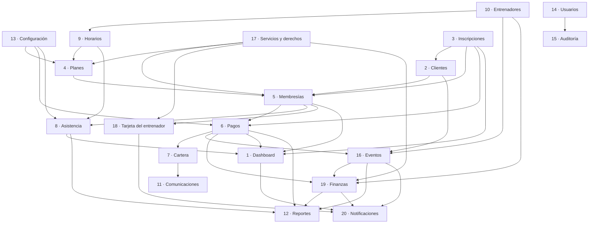

# 02 · Mapa de módulos

Cada módulo se describe con: **qué hace**, **entidades que gobierna**, **de qué depende** y **qué expone
a los demás**. La columna *Fase* remite a [10-fases-desarrollo.md](10-fases-desarrollo.md).

---

## Portal público

| # | Módulo | Qué hace | Entidades | Fase |
|---|---|---|---|---|
| P1 | **Home / Institucional** | Presentación del gimnasio, ubicación, contacto, redes. Contenido desde `business_settings`. | — | F6 |
| P2 | **Catálogo de planes** | Lista solo planes con `is_public = true`. Comparador lado a lado. Detalle por plan. | `plans` | F6 |
| P3 | **Inscripción** | Formulario por pasos: plan → datos → fecha → horario → consentimientos → pago. Guarda progreso. | `registrations` | F6 |
| P4 | **Checkout** | Selección de método; redirección al proveedor o instrucción de pago presencial. | `payment_intents` | F7 |
| P5 | **Confirmación / Recuperación** | Estado real de la inscripción. Enlace firmado para retomar una inscripción incompleta. | `registrations` | F7 |

## Portal administrativo

| # | Módulo | Qué hace | Entidades que gobierna | Depende de | Fase |
|---|---|---|---|---|---|
| 1 | **Dashboard** | 13 indicadores, 8 alertas, 8 acciones rápidas. Solo lectura agregada. | — (lee de todos) | todos | F5 |
| 2 | **Clientes** | Ficha 360°: datos, estado, membresía vigente, saldo, historiales, documentos, consentimientos. | `clients`, `emergency_contacts`, `client_notes`, `documents`, `consents` | Membresías, Pagos | F2 |
| 3 | **Inscripciones** | Bandeja de solicitudes web y presenciales. Detección de duplicados. Aprobar / rechazar / convertir. | `registrations` | Clientes, Planes, Membresías | F6 |
| 4 | **Planes** | Constructor de planes por reglas. Crear, editar, duplicar, ocultar, desactivar, promociones. | `plans`, `plan_slot_rules` | Horarios | F3 |
| 5 | **Membresías** | Contratos vivos. Activar, renovar, extender, pausar, congelar, reactivar, cambiar plan, cancelar, cortesías. | `memberships`, `membership_changes` | Clientes, Planes, Pagos | F3 |
| 6 | **Pagos** | Cargos y movimientos. Registrar, aplicar, corregir, anular, reembolsar, comprobantes. | `charges`, `payments`, `payment_allocations`, `receipts`, `refunds`, `payment_methods` | Membresías | F4 |
| 7 | **Cartera** | Gestión de cobro: mora, compromisos, gestiones, recordatorios. | `collection_cases`, `collection_actions`, `reminders` | Pagos | F8 |
| 8 | **Asistencia** | Check-in con validación de membresía y reglas. Accesos excepcionales autorizados. | `attendance`, `attendance_exceptions` | Membresías, Horarios | F4 |
| 9 | **Horarios y cupos** | Franjas semanales, capacidad, ocupación, excepciones, bloqueos, cancelaciones, asignación de clientes. | `schedules`, `schedule_slots`, `slot_occurrences`, `slot_enrollments` | Entrenadores | F3 |
| 10 | **Entrenadores** | Perfil, disponibilidad, clientes y franjas asignadas. | `trainers`, `client_assignments` | Usuarios | F3 |
| 11 | **Comunicaciones** | Plantillas con variables, WhatsApp click-to-chat, correos transaccionales, bitácora, segmentos. | `message_templates`, `messages`, `notifications` | Clientes | F8 |
| 12 | **Reportes** | Financieros, comerciales y operativos. Filtros por rango. Exportación CSV auditada. | — (lectura) | todos | F9 |
| 13 | **Configuración** | Identidad, contacto, horarios de atención, métodos de pago, políticas, textos legales, días no laborables, gracia, plantillas, integraciones, reglas de vencimiento. | `business_settings`, `holidays`, `payment_methods` | — | F2 |
| 14 | **Usuarios y permisos** | Usuarios internos, roles, permisos, invitaciones, sesiones activas. | `users`, `roles`, `permissions`, `role_permissions`, `user_roles` | — | F1 |
| 15 | **Auditoría** | Bitácora inmutable consultable con filtros y comparación antes/después. | `audit_logs` | todos | F1 |
| 16 | **Eventos y clases especiales** | Actividades con página pública propia, cupos, lista de espera, check-in y rentabilidad. → [11](11-modulo-eventos.md) | `events`, `event_sessions`, `event_prices`, `event_registrations`, `event_waitlist`, `event_attendance`, `event_staff`, `event_categories` | Clientes, Pagos, Entrenadores | F6b |
| 17 | **Servicios y derechos** | Catálogo de servicios, qué incluye cada plan, contadores por membresía, autorizaciones de excepción. → [12](12-servicios-y-entrenadores.md) | `services`, `plan_entitlements`, `membership_entitlements`, `service_usages`, `service_authorizations` | Planes, Membresías | **F3** |
| 18 | **Acceso rápido del entrenador** | Tarjeta de consulta: qué tiene contratado esta persona. Sin cifras de dinero. → [12](12-servicios-y-entrenadores.md#4-tarjeta-rápida-del-entrenador) | — (lee de 17) | Servicios, Membresías | F4 |
| 19 | **Finanzas** | Ingresos, gastos, periodos contables, liquidación de entrenadores y rentabilidad. → [13](13-finanzas.md) | `expenses`, `expense_categories`, `income_entries`, `financial_periods`, `trainer_rates`, `trainer_services`, `trainer_settlements`, `trainer_settlement_items`, `trainer_payments` | Pagos, Entrenadores, Eventos | F10 |
| 20 | **Centro de notificaciones** | Avisos internos con prioridad, responsable, resolución y canales configurables. → [14](14-notificaciones.md) | `notifications`, `notification_types`, `notification_recipients`, `notification_preferences`, `notification_logs` | todos | F11 |

## Servicios transversales (no son pantallas)

| Servicio | Responsabilidad |
|---|---|
| **AuthService** | Sesión, contraseñas (Argon2id), bloqueo por intentos, recuperación. |
| **RbacService** | `can(actor, permiso, recurso?)`. Punto único de autorización. |
| **AuditService** | `record({ actor, action, entity, before, after, reason, ip })`. Llamado *dentro* de la transacción. |
| **PaymentGateway** | Adaptador del proveedor. Ver [01-arquitectura.md](01-arquitectura.md#6-adaptador-de-pagos). |
| **NotificationService** | Cola de salida (outbox) → correo / WhatsApp / push (futuro). |
| **JobRunner** | Vencimientos, próximos a vencer, recordatorios, conciliación, expiración de inscripciones. |
| **SettingsService** | Lectura cacheada de `business_settings`. Toda regla configurable pasa por aquí. |
| **StorageService** | Subida y URLs firmadas de documentos y comprobantes. |

## Dependencias entre módulos

**Lectura del grafo → orden de construcción:** Usuarios/Auditoría y Configuración son la base;
Clientes es la raíz operativa; **Servicios y derechos (17) entra junto a Planes**, porque los modifica;
Planes+Horarios habilitan Membresías; Membresías habilita Pagos, Asistencia y la Tarjeta del entrenador;
Inscripciones necesita todo lo anterior; Eventos se apoya en Clientes y Pagos; Finanzas necesita Pagos,
Eventos y Entrenadores para poder calcular rentabilidad; Dashboard, Reportes y Notificaciones van al
final porque dependen de que exista algo que mostrar y avisar.

> ⚠️ **El módulo 17 no es opcional ni posponible.** Cambia la estructura de `plans` y `memberships`.
> Construirlo después obligaría a migrar todas las membresías ya vendidas. Ver
> [12-servicios-y-entrenadores.md](12-servicios-y-entrenadores.md#1-el-problema-y-la-decisión).

---

**Anterior:** [01-arquitectura.md](01-arquitectura.md) · **Siguiente:** [03-roles-y-permisos.md](03-roles-y-permisos.md)
