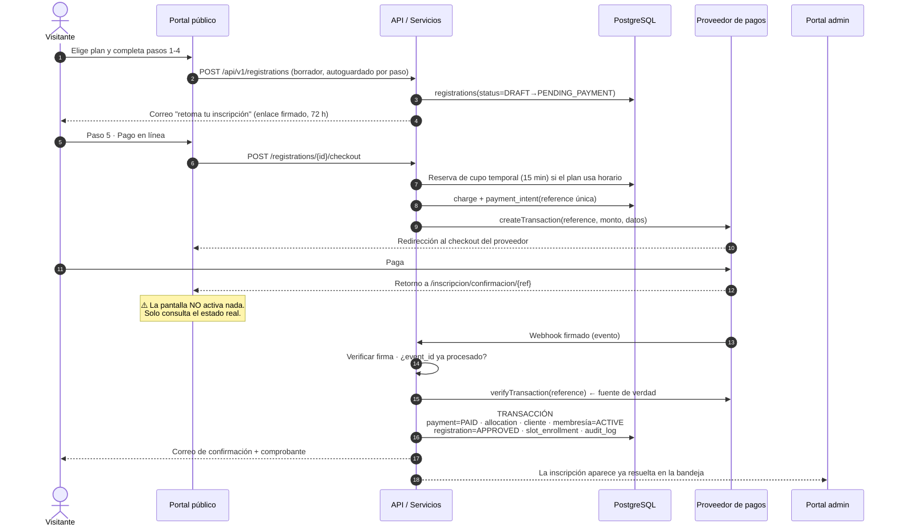
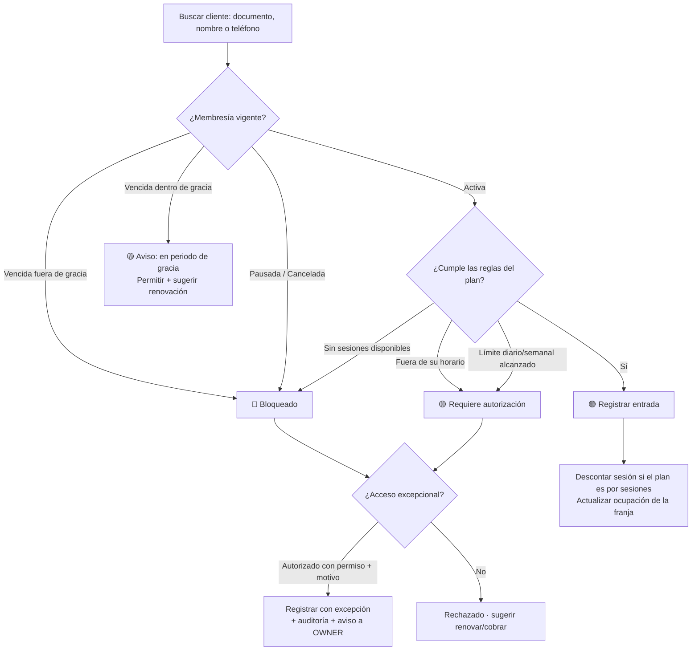
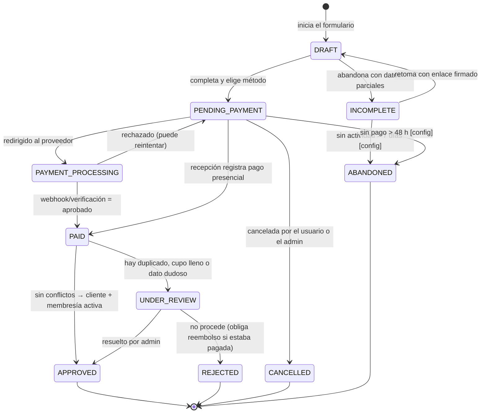
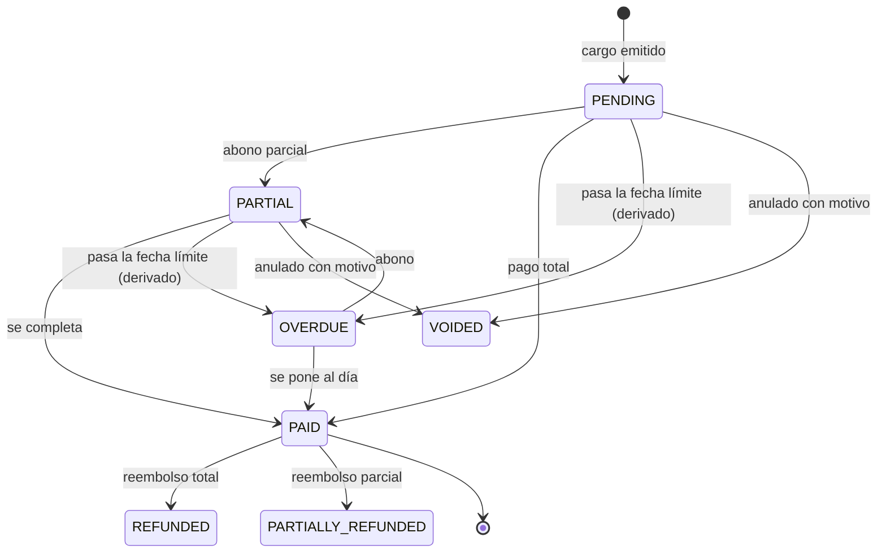
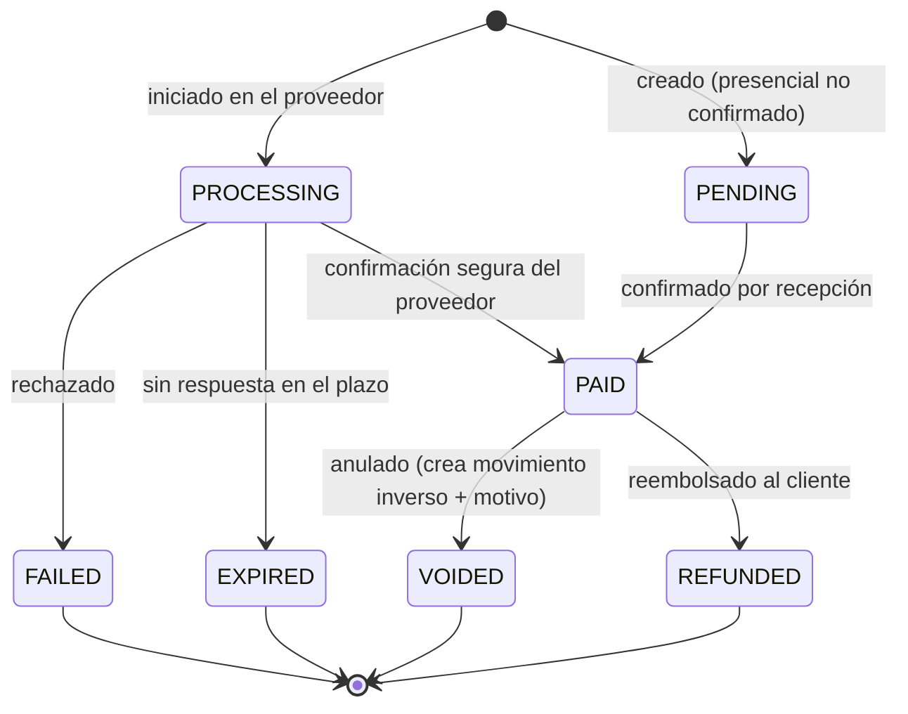

# 05 · Flujos principales y diagramas de estado

## 1. Flujo A — Inscripción en línea con pago en línea

El flujo más crítico del sistema, porque cruza portal público, pagos y activación.



**Si el webhook nunca llega:** un job cada 5 minutos toma los `payment_intents` en `PROCESSING` con más
de 10 minutos y ejecuta `verifyTransaction`. Si el proveedor dice `APPROVED`, se ejecuta exactamente la
misma transacción (idempotente). Si dice `DECLINED`, el cargo vuelve a `PENDING` y se libera el cupo.

## 2. Flujo B — Inscripción en línea con pago presencial

Idéntico hasta el paso 5. Al elegir "Pagar en el gimnasio":
`registration = PENDING_PAYMENT` · `charge = PENDING` · cliente creado en estado `PAGO PENDIENTE` ·
membresía creada en `PENDING` (**no activa**) · reserva de cupo con vigencia configurable `[TEMP: 48 h]` ·
la inscripción aparece en la bandeja admin marcada "Esperando pago presencial".
Cuando recepción registra el pago, se dispara la misma activación del Flujo A.

## 3. Flujo C — Registro presencial (recepción)

```
Buscar por documento
├─ Existe  → abrir ficha → [Nueva membresía]
└─ No existe → [Nuevo cliente] (formulario corto: nombre, documento, teléfono; el resto es opcional)
                  ↓
            Seleccionar plan → precio sugerido (editable si tiene permiso de descuento)
                  ↓
            Fecha de inicio (hoy por defecto) → horario si el plan lo exige (valida cupo)
                  ↓
            Consentimientos (firma en pantalla o marcado por el operador)
                  ↓
            ¿Paga ahora?
            ├─ Sí → registrar pago → membresía ACTIVE
            └─ No → membresía PENDING + cargo PENDING → entra a Cartera
```
Meta de diseño: **menos de 90 segundos** desde "hola" hasta cliente activo.

## 4. Flujo D — Check-in de asistencia



## 5. Flujo E — Renovación

Origen: alerta del dashboard, cartera, ficha del cliente o (futuro) portal del miembro.

```
Membresía por vencer/vencida → [Renovar]
   ↓
Plan sugerido = el actual (cambiable) · precio = precio VIGENTE del plan hoy (no el congelado)
   ↓
Fecha de inicio calculada:
   ├─ Renovación anticipada (aún vigente) → inicia el día siguiente al vencimiento actual (encadena, no pierde días)
   ├─ Vencida dentro de gracia          → inicia hoy  [configurable: o continuar desde el vencimiento]
   └─ Vencida hace mucho                → inicia hoy
   ↓
Se crea una MEMBRESÍA NUEVA (nunca se modifica la anterior) con previous_membership_id
   ↓
Cargo → pago → ACTIVE. La anterior pasa a EXPIRED/COMPLETED.
```

## 6. Flujo F — Cobro de cartera

```
Job diario → detecta cargos con saldo y fecha límite vencida
   ↓ crea/actualiza collection_case (días de mora = hoy − fecha límite)
   ↓ dispara recordatorio según reglas configurables (−3 días, día 0, +3, +7…)
Recepción abre Cartera → ordena por días de mora
   ↓ [Contactar] → WhatsApp con plantilla → registra collection_action(canal, resultado)
   ↓ [Compromiso de pago] → fecha comprometida → reaparece ese día
   ↓ Pago registrado → cargo saldado → caso cerrado automáticamente
```

---

# Diagramas de estado

## 7. Estados de INSCRIPCIÓN (`registrations`)



**Invariantes:** `APPROVED` implica cliente + membresía creados · una inscripción `PAID` nunca se borra ·
`REJECTED` con dinero recibido exige registrar un reembolso o una nota de crédito.

## 8. Estados de MEMBRESÍA (`memberships`)

```mermaid
stateDiagram-v2
    [*] --> PENDING: creada, esperando pago/activación
    PENDING --> ACTIVE: pago confirmado o activación autorizada
    PENDING --> CANCELLED: no se concretó
    ACTIVE --> PAUSED: pausa con motivo (el reloj se detiene)
    PAUSED --> ACTIVE: reactivar (fin += días pausados)
    ACTIVE --> EXPIRED: llega end_date (derivado; job lo materializa)
    ACTIVE --> COMPLETED: se agotan las sesiones (planes por sesión)
    ACTIVE --> CANCELLED: cancelación con motivo (¿reembolso?)
    ACTIVE --> SUPERSEDED: cambio de plan → nace otra membresía
    EXPIRED --> ACTIVE: reactivación dentro de la gracia
    EXPIRED --> [*]
    COMPLETED --> [*]
    CANCELLED --> [*]
    SUPERSEDED --> [*]
```



> `PRÓXIMA A VENCER` **no es un estado almacenado**: es `ACTIVE AND end_date <= hoy + umbral`.
> Igual `EN GRACIA`: `EXPIRED AND hoy <= end_date + grace_days`. Así no hay estados desincronizados.

**Regla de unicidad:** un cliente tiene **como máximo una** membresía en `ACTIVE|PENDING|PAUSED` a la vez,
salvo que la configuración permita membresías complementarias `[TEMP: no permitido]`.

## 9. Estados de CARGO (`charges`) y PAGO (`payments`)

**Cargo — lo que el cliente debe:**



**Pago — el movimiento de dinero:**



**Invariantes financieras:**
- `payments` es *append-only*. `VOIDED` conserva la fila original y crea el movimiento inverso.
- `saldo_cargo = charge.amount − Σ(allocations de pagos PAID) + Σ(reembolsos)`. **Nunca** se guarda un
  saldo denormalizado como fuente de verdad; si se cachea, se recalcula y se concilia a diario.
- Un pago en línea solo llega a `PAID` por `verifyTransaction` o webhook firmado. Jamás por navegación.

## 10. Estados de CLIENTE (`clients`) — derivados

El estado del cliente **se calcula**, salvo dos anulaciones manuales:

| Estado mostrado | Cómo se determina |
|---|---|
| `PROSPECTO` | Existe sin ninguna membresía |
| `INSCRIPCIÓN PENDIENTE` | Tiene inscripción en `DRAFT/INCOMPLETE` |
| `PAGO PENDIENTE` | Membresía `PENDING` con cargo sin saldar |
| `ACTIVO` | Membresía `ACTIVE` y `end_date > hoy + umbral` |
| `PRÓXIMO A VENCER` | Membresía `ACTIVE` y `end_date <= hoy + umbral` |
| `VENCIDO` | Última membresía `EXPIRED` |
| `PAUSADO` | Membresía `PAUSED` |
| `CANCELADO` | Última membresía `CANCELLED` |
| `INACTIVO` | Sin membresía vigente hace más de N días `[TEMP: 90]` |
| `BLOQUEADO` | **Anulación manual** `status_override = BLOCKED` (requiere motivo y auditoría) |

`status_override` gana siempre sobre el cálculo, se muestra con un distintivo visual y exige motivo.

---

**Anterior:** [04-navegacion.md](04-navegacion.md) · **Siguiente:** [06-modelo-datos.md](06-modelo-datos.md)
