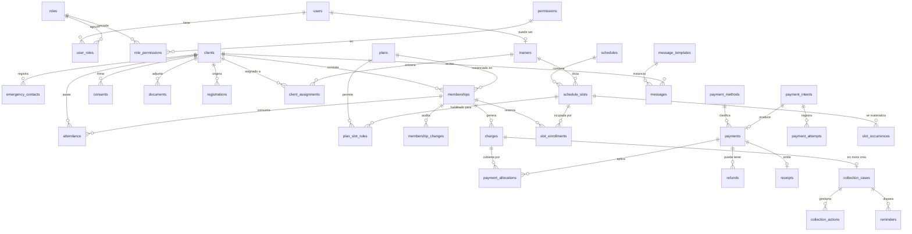

# 06 · Modelo de datos

> Convenciones: PK `id uuid v7` · `created_at`/`updated_at` `timestamptz` · dinero `bigint` en unidades
> menores (COP, exponente 0) · fechas de negocio `date` en `America/Bogota` · `location_id uuid NULL`
> en tablas operativas (preparación multi-sede) · `deleted_at` solo donde se indica.

---

## Decisión: cargos vs. pagos

La especificación pedía que `payments` guardara *valor esperado*, *valor pagado* y *saldo*. Mezclar la
obligación con el movimiento rompe cuatro casos reales del gimnasio:

1. **Pago parcial en dos momentos** — $60.000 hoy y $40.000 el viernes contra la misma mensualidad.
2. **Un pago que salda dos cosas** — mensualidad + matrícula en una sola transferencia.
3. **Cartera con mora** — necesita una fecha límite que pertenece a la obligación, no al movimiento.
4. **Anulación y reembolso** — anular un movimiento no debe borrar la deuda; reembolsar no debe borrar el pago.

Por eso el modelo separa:

```
memberships ──1:N──► charges (obligación: cuánto, por qué, para cuándo)
                        ▲
                        │ payment_allocations (cuánto de este pago cubre este cargo)
                        │
                     payments (movimiento: cuánto entró, cómo, cuándo, quién lo registró)
```

El caso simple —una mensualidad pagada de una vez— genera 1 cargo + 1 pago + 1 asignación, y la UI lo
presenta como **una sola operación**. La complejidad existe en el modelo, no en la pantalla.

---

## ERD — núcleo



---

## 1. Identidad y acceso

**`users`** — personal interno (y, más adelante, clientes con acceso)
`id` · `email` (único, citext) · `password_hash` (Argon2id) · `full_name` · `phone` · `avatar_url` ·
`is_active` · `must_change_password` · `last_login_at` · `failed_attempts` · `locked_until` ·
`two_factor_secret` (nullable, futuro) · `deleted_at`

**`roles`** — `id` · `code` (único: `OWNER`, `FRONT_DESK`, `TRAINER`, `CLIENT`) · `name` · `description` ·
`is_system` (los del sistema no se borran)

**`permissions`** — `id` · `code` (único, `recurso.acción`) · `module` · `description`
*Se siembra desde una constante de código; nunca se crea desde la UI.*

**`role_permissions`** — `role_id` · `permission_id` — PK compuesta
**`user_roles`** — `user_id` · `role_id` · `granted_by` · `granted_at` — PK compuesta

**`sessions`** — `id` · `user_id` · `token_hash` · `ip` · `user_agent` · `expires_at` · `revoked_at`
*Sesión en base de datos para poder revocarla al instante.*

---

## 2. Clientes

**`clients`**

| Campo | Tipo | Nota |
|---|---|---|
| `id` | uuid | |
| `user_id` | uuid NULL | 🔜 portal del miembro |
| `code` | text único | consecutivo legible (MFC-00123) |
| `first_name`, `last_name` | text | |
| `document_type` | enum | `CC`,`CE`,`TI`,`PA`,`NIT`,`PEP`,`PPT` |
| `document_number` | text | **único** con `document_type` |
| `birth_date` | date NULL | |
| `gender` | text NULL | opcional, no obligatorio |
| `phone`, `whatsapp` | text | `whatsapp` se autocompleta desde `phone` |
| `email` | citext NULL | único parcial cuando no es nulo |
| `address`, `city` | text NULL | |
| `photo_url` | text NULL | |
| `acquisition_channel` | text NULL | catálogo configurable |
| `registered_at` | timestamptz | |
| `status_override` | enum NULL | `BLOCKED`/`INACTIVE` — anula el estado calculado |
| `status_override_reason` | text NULL | obligatorio si hay override |
| `access_code` | text NULL | 🔜 QR |
| `search_vector` | tsvector | índice GIN para la búsqueda global |
| `deleted_at` | timestamptz NULL | |

**Índices:** `(document_type, document_number)` único · `lower(email)` único parcial · `phone` ·
GIN sobre `search_vector`.

**`emergency_contacts`** — `id` · `client_id` · `name` · `relationship` · `phone` · `is_primary`

**`client_notes`** — `id` · `client_id` · `author_id` · `body` · `visibility` (`INTERNAL`|`TRAINER`) ·
`created_at` *(inmutable: se corrige añadiendo otra nota)*

**`consents`** — `id` · `client_id` · `type` (`TERMS`,`DATA_PROCESSING`,`IMAGE_RIGHTS`,`HEALTH_DECLARATION`) ·
`document_version` · `accepted_at` · `ip` · `user_agent` · `channel` (`WEB`|`ONSITE`) · `signature_url` NULL
*Se guarda la **versión** del texto aceptado. Cambiar los T&C no reescribe consentimientos pasados.*

**`documents`** — `id` · `client_id` · `type` · `file_key` (S3) · `file_name` · `mime` · `size_bytes` ·
`uploaded_by` · `uploaded_at`

---

## 3. Planes — el motor de reglas

**`plans`**

| Campo | Tipo | Nota |
|---|---|---|
| `id`, `slug`, `name`, `description` | | `slug` único para la URL pública |
| `price` | bigint | precio vigente |
| `currency` | char(3) | `COP` |
| `duration_value` | int NULL | p. ej. `1` |
| `duration_unit` | enum NULL | `DAY`,`WEEK`,`MONTH`,`YEAR` |
| `session_limit` | int NULL | planes por sesiones |
| `weekly_frequency` | int NULL | veces por semana permitidas |
| `daily_visit_limit` | int | por defecto `1` |
| `weekly_visit_limit`, `monthly_visit_limit` | int NULL | |
| `modality` | enum | `OPEN`,`GROUP`,`SEMI_PERSONAL`,`PERSONAL` |
| `requires_schedule` | bool | si exige elegir franja |
| `max_capacity` | int NULL | cupo global del plan |
| `default_trainer_id` | uuid NULL | |
| `grace_days` | int | por defecto desde configuración |
| `allows_discount` | bool | |
| `max_discount_percent` | int NULL | |
| `promo_price` | bigint NULL | |
| `promo_starts_at`, `promo_ends_at` | date NULL | |
| `auto_renew` | bool | 🔜 |
| `is_public` | bool | visible en el catálogo web |
| `is_recommended` | bool | cinta "RECOMENDADO" en la tabla pública. **Solo uno a la vez** (índice único parcial) |
| `allows_online_registration` | bool | |
| `allows_online_payment` | bool | |
| `status` | enum | `DRAFT`,`ACTIVE`,`HIDDEN`,`ARCHIVED` |
| `benefits` | jsonb | lista de textos para la web |
| `rules` | jsonb | reglas extra sin migración (`{"minAge":16}`) |
| `sort_order` | int | orden en el catálogo |
| `deleted_at` | timestamptz NULL | |

> **Los 10 tipos de plan salen de combinar estos campos.** Ejemplos:
> *Mensual* = `duration 1 MONTH` + `modality OPEN` · *Por sesiones* = `session_limit 10` + sin duración
> (o con vencimiento largo) · *Semipersonalizado* = `modality SEMI_PERSONAL` + `requires_schedule` +
> `max_capacity` · *De prueba* = `duration 1 DAY` + `price 0` + `is_public` · *De cortesía* = `price 0` +
> `is_public false` · *Corporativo* = `is_public false` + `allows_discount` con tope alto.
> **No existe una columna `plan_type`.**

**`plan_slot_rules`** — `plan_id` · `schedule_slot_id` — qué franjas admite el plan

---

## 4. Membresías — el contrato congelado

**`memberships`**

| Campo | Tipo | Nota |
|---|---|---|
| `id` · `client_id` · `plan_id` | | `plan_id` es referencia informativa |
| **`plan_snapshot`** | jsonb NOT NULL | 🔒 **copia íntegra del plan al vender**: precio, duración, sesiones, límites, gracia, reglas |
| `list_price` | bigint | precio de lista en ese momento |
| `discount_amount` | bigint | |
| `discount_reason` | text NULL | obligatorio si hay descuento |
| `discount_approved_by` | uuid NULL | si superó el tope |
| `final_price` | bigint | `list_price − discount_amount` |
| `start_date` · `end_date` | date | `end_date` NULL en planes solo por sesiones |
| `sessions_included` | int NULL | |
| `sessions_used` | int | contador denormalizado, reconciliado contra `attendance` |
| `status` | enum | `PENDING`,`ACTIVE`,`PAUSED`,`EXPIRED`,`COMPLETED`,`CANCELLED`,`SUPERSEDED` |
| `paused_at` · `paused_days_total` | | para devolver los días al reactivar |
| `courtesy_days` | int | días regalados (auditados) |
| `trainer_id` · `schedule_slot_id` | uuid NULL | |
| `previous_membership_id` | uuid NULL | cadena de renovaciones |
| `source` | enum | `WEB`,`ONSITE`,`IMPORT`,`RENEWAL` |
| `registration_id` | uuid NULL | |
| `cancelled_at` · `cancel_reason` | | |
| `notes` | text NULL | |
| `created_by` | uuid | |

**Índices:** `(client_id, status)` · `(status, end_date)` ← consulta del dashboard y del job de vencimientos ·
único parcial: una sola membresía por cliente en `('PENDING','ACTIVE','PAUSED')`.

**`membership_changes`** — bitácora específica del contrato
`id` · `membership_id` · `action` (`ACTIVATE`,`RENEW`,`EXTEND`,`PAUSE`,`RESUME`,`CHANGE_PLAN`,`CANCEL`,
`COURTESY_DAYS`,`TRANSFER_BALANCE`,`ADJUST_DATES`,`EXCEPTION`) · `before` jsonb · `after` jsonb ·
`reason` text · `performed_by` · `performed_at`
*Complementa `audit_logs`; existe aparte porque se muestra al usuario en la ficha del cliente.*

---

## 5. Inscripciones

**`registrations`** — `id` · `reference` (único, legible) · `client_id` NULL (hasta aprobar) ·
`plan_id` · `status` (ver [05](05-flujos-y-estados.md#7-estados-de-inscripción-registrations)) ·
`form_data` jsonb (datos capturados antes de existir el cliente) · `desired_start_date` ·
`schedule_slot_id` NULL · `payment_preference` · `source` (`WEB`|`ONSITE`) · `resume_token_hash` ·
`resume_expires_at` · `duplicate_candidates` jsonb · `reviewed_by` · `review_notes` ·
`utm` jsonb · `ip` · `user_agent` · `submitted_at` · `resolved_at`

**`registration_events`** — traza de cada paso completado (para medir en qué paso se abandona).

---

## 6. Dinero

**`payment_methods`** — configurable · `code` (`CASH`,`TRANSFER`,`CARD_TERMINAL`,`ONLINE`,`OTHER`) ·
`name` · `is_active` · `requires_reference` · `requires_proof` · `is_online` · `instructions` · `sort_order`

**`charges`** — la obligación
`id` · `client_id` · `membership_id` NULL · `event_registration_id` NULL ·
`concept` (`MEMBERSHIP`,`ENROLLMENT_FEE`,`EVENT`,`EXTRA_SESSION`,`SERVICE_AUTHORIZATION`,`PRODUCT`,`PENALTY`,`OTHER`) ·
`description` · `amount` bigint · `currency` · `due_date` date · `status` · `voided_at` · `void_reason` ·
`created_by`
> `paid_amount` y `balance` se **calculan**; si se materializan, es como columna cacheada con reconciliación diaria.

**`payments`** — el movimiento (**append-only**)
`id` · `client_id` · `payment_method_id` · `amount` bigint · `currency` · `paid_at` timestamptz ·
`reference` text NULL (transferencia/datáfono) · `proof_url` NULL · `status` · `payment_intent_id` NULL ·
`registered_by` · `notes` · `voided_at` · `void_reason` · `voided_by` · `reversal_of_payment_id` NULL ·
`idempotency_key` único NULL

**`payment_allocations`** — `id` · `payment_id` · `charge_id` · `amount`
*Invariante:* `Σ allocations.amount por payment ≤ payment.amount`.

**`refunds`** — `id` · `payment_id` · `amount` · `reason` · `method` · `status` · `provider_refund_id` ·
`requested_by` · `approved_by` · `processed_at`

**`receipts`** — `id` · `number` (consecutivo único) · `client_id` · `payment_id` · `issued_at` ·
`snapshot` jsonb (datos congelados del comprobante) · `pdf_key` NULL (🔜) · `sent_at`

### Pagos en línea

**`payment_intents`** — `id` · `reference` **única generada por nosotros** · `provider` · `client_id` NULL ·
`registration_id` NULL · `membership_id` NULL · `charge_id` NULL · `amount` · `currency` ·
`status` (`CREATED`,`PROCESSING`,`APPROVED`,`DECLINED`,`EXPIRED`,`ERROR`) · `provider_transaction_id` NULL ·
`checkout_url` · `expires_at` · `idempotency_key` único · `last_verified_at`

**`payment_attempts`** — `id` · `payment_intent_id` · `attempt_number` · `event_type` (`CREATE`,`WEBHOOK`,`VERIFY`,`REFUND`) ·
`provider_event_id` (**único** → idempotencia del webhook) · `http_status` · `raw_request` jsonb ·
`raw_response` jsonb · `signature_valid` bool · `error_code` · `error_message` · `occurred_at`
*Nunca se borra. Es la caja negra de la conciliación.*

---

## 7. Cartera

**`collection_cases`** — `id` · `client_id` · `charge_id` · `days_overdue` (calculado) · `outstanding_amount` ·
`status` (`OPEN`,`PROMISED`,`PARTIAL`,`CLOSED`,`WRITTEN_OFF`) · `last_contact_at` · `next_action_at` ·
`promised_amount` · `promised_date` · `assigned_to` · `closed_at`

**`collection_actions`** — `id` · `collection_case_id` · `performed_by` · `performed_at` ·
`channel` (`WHATSAPP`,`CALL`,`EMAIL`,`IN_PERSON`,`SMS`) · `result` (`CONTACTED`,`NO_ANSWER`,`PROMISED`,`PAID`,`REFUSED`,`WRONG_NUMBER`) ·
`notes` · `next_action_at`

**`reminders`** — `id` · `client_id` · `charge_id` NULL · `membership_id` NULL ·
`type` (`BEFORE_DUE`,`ON_DUE`,`AFTER_DUE`,`RENEWAL`,`PAYMENT_CONFIRMED`) · `scheduled_for` · `channel` ·
`status` (`SCHEDULED`,`SENT`,`FAILED`,`CANCELLED`) · `sent_at` · `template_id` · `error`

---

## 8. Asistencia

**`attendance`** — `id` · `client_id` · `membership_id` · `schedule_slot_id` NULL · `checked_in_at` ·
`business_date` date (**clave de las reglas diarias**) · `source` (`MANUAL`,`QR`,`KIOSK`) ·
`registered_by` NULL · `consumed_session` bool · `is_exception` bool · `exception_reason` ·
`authorized_by` NULL · `notes`
**Índices:** `(client_id, business_date)` · `(business_date)` · `(schedule_slot_id, business_date)`
> Sin *unique* estricto por `(client_id, business_date)`: hay planes que permiten varias entradas al día.
> El límite lo impone la regla del plan, no el esquema.

---

## 9. Horarios y cupos

**`schedules`** — agrupador (`Mañana`, `Tarde`, `Funcional`) · `name` · `description` · `is_active`

**`schedule_slots`** — franja recurrente
`id` · `schedule_id` · `name` · `weekday` (0-6) · `start_time` · `end_time` · `capacity` ·
`trainer_id` NULL · `location_id` NULL · `is_active` · `valid_from` · `valid_until` NULL

**`slot_occurrences`** — instancia de una fecha concreta, **solo se crea cuando hay una excepción**
`id` · `schedule_slot_id` · `date` · `status` (`SCHEDULED`,`CANCELLED`,`BLOCKED`,`MODIFIED`) ·
`capacity_override` · `trainer_override` · `reason` · `created_by`
> Materializar todas las ocurrencias del año sería basura; se crean bajo demanda.

**`slot_enrollments`** — cliente asignado a una franja
`id` · `schedule_slot_id` · `client_id` · `membership_id` · `status` (`ACTIVE`,`MOVED`,`CANCELLED`,`RESERVED`) ·
`reserved_until` (reserva temporal del checkout) · `moved_to_slot_id` · `created_by`
**Índice único parcial:** `(schedule_slot_id, client_id)` cuando `status = 'ACTIVE'`.

**`holidays`** — `date` · `name` · `blocks_operations`

---

## 10. Entrenadores

**`trainers`** — `id` · `user_id` NULL · `full_name` · `document_number` · `phone` · `email` ·
`specialties` jsonb · `bio` · `photo_url` · `is_active` · `is_public` (aparece en la web) ·
`employment_type` (`EMPLOYEE`,`CONTRACTOR`,`HOURLY`,`PARTNER`) · `payout_method` · `payout_account` (cifrado) ·
`usual_payment_day`

**`trainer_assignments`** *(sustituye a `client_assignments`)* — tabla polimórfica que resuelve las seis
formas de asignación con una sola estructura. Especificación completa y **orden de precedencia** en
[12-servicios-y-entrenadores.md](12-servicios-y-entrenadores.md#6-asignación-de-entrenadores).

---

## 11. Comunicaciones

**`message_templates`** — `id` · `code` · `name` · `channel` (`WHATSAPP`,`EMAIL`,`SMS`,`PUSH`) ·
`subject` NULL · `body` (con variables `{{cliente.nombre}}`, `{{membresia.vencimiento}}`) ·
`variables` jsonb · `category` · `is_active` · `is_system`

**`messages`** — bitácora de cada envío · `id` · `client_id` · `template_id` NULL · `channel` ·
`to_address` · `subject` · `body_rendered` · `status` (`QUEUED`,`SENT`,`DELIVERED`,`FAILED`,`OPENED`) ·
`provider_message_id` · `sent_by` NULL (nulo = automático) · `sent_at` · `error` · `context` jsonb

**`notifications`** — avisos internos para el personal · `id` · `user_id` NULL (nulo = para todos) ·
`type` · `title` · `body` · `link` · `severity` · `read_at` · `created_at`

---

## 12. Sistema

**`business_settings`** — clave/valor tipado y agrupado, **no** una fila gigante
`id` · `key` (único) · `group` (`business`,`branding`,`payments`,`rules`,`legal`,`integrations`,`messaging`) ·
`value` jsonb · `type` · `is_sensitive` (se cifra en reposo y se enmascara en la UI) · `description` ·
`updated_by` · `updated_at`

<details>
<summary>Claves iniciales <code>[TEMP]</code></summary>

`business.name` `business.legal_name` `business.tax_id` `business.address` `business.city`
`business.phone` `business.whatsapp` `business.email` `business.social.*` `business.timezone=America/Bogota`
`branding.logo_url` `branding.color.primary` `branding.color.accent`
`rules.expiring_soon_days=5` `rules.default_grace_days=0` `rules.inactive_after_days=90`
`rules.registration_expires_hours=48` `rules.draft_expires_days=7` `rules.slot_hold_minutes=15`
`rules.allow_multiple_active_memberships=false` `rules.attendance.block_on_expired=true`
`payments.max_discount_percent_front_desk=0` `payments.currency=COP` `payments.online_enabled=false`
`payments.onsite_enabled=true` `payments.transfer_instructions`
`legal.terms_version` `legal.privacy_version` `legal.data_processing_version`
`integrations.payment_provider` `integrations.email_provider` `integrations.storage_provider`
</details>

**`audit_logs`** — bitácora inmutable global
`id` · `actor_id` NULL · `actor_email` (copiado, sobrevive al borrado del usuario) · `actor_role` ·
`action` (`payment.void`, `membership.extend`…) · `entity_type` · `entity_id` · `before` jsonb ·
`after` jsonb · `reason` · `ip` · `user_agent` · `session_id` · `request_id` · `severity` · `created_at`
**Índices:** `(entity_type, entity_id, created_at)` · `(actor_id, created_at)` · `(action, created_at)`
*Sin `UPDATE` ni `DELETE`: se revoca el permiso a nivel de base de datos.*

**`idempotency_keys`** — `key` (PK) · `scope` · `request_hash` · `response` jsonb · `status` · `expires_at`

**`outbox`** — efectos secundarios encolados dentro de la transacción (correo, notificación, webhook saliente)
`id` · `topic` · `payload` jsonb · `status` · `attempts` · `next_retry_at` · `processed_at` · `error`

**`job_runs`** — `id` · `job_name` · `started_at` · `finished_at` · `status` · `items_processed` · `error`

---

## 13. Reglas de integridad en base de datos

Estas se aplican con constraints, no solo con código:

```sql
-- Un cliente no puede tener dos membresías vivas
CREATE UNIQUE INDEX uq_membership_active ON memberships (client_id)
  WHERE status IN ('PENDING','ACTIVE','PAUSED');

-- Un cliente no se inscribe dos veces en la misma franja
CREATE UNIQUE INDEX uq_slot_enrollment ON slot_enrollments (schedule_slot_id, client_id)
  WHERE status = 'ACTIVE';

-- Idempotencia del webhook
CREATE UNIQUE INDEX uq_provider_event ON payment_attempts (provider_event_id)
  WHERE provider_event_id IS NOT NULL;

-- Documento único
CREATE UNIQUE INDEX uq_client_document ON clients (document_type, document_number)
  WHERE deleted_at IS NULL;

-- Importes no negativos
ALTER TABLE payments ADD CONSTRAINT ck_payment_amount CHECK (amount > 0);
ALTER TABLE charges  ADD CONSTRAINT ck_charge_amount  CHECK (amount >= 0);
ALTER TABLE memberships ADD CONSTRAINT ck_final_price CHECK (final_price >= 0);

-- Coherencia de fechas
ALTER TABLE memberships ADD CONSTRAINT ck_dates CHECK (end_date IS NULL OR end_date >= start_date);

-- Solo un plan puede llevar la cinta "RECOMENDADO"
CREATE UNIQUE INDEX uq_plan_recommended ON plans ((true))
  WHERE is_recommended = true AND deleted_at IS NULL;
```

## 14. Entidades de la ampliación

Las tablas de eventos, servicios, finanzas y notificaciones se especifican en sus propios documentos.
Aquí queda la **correspondencia entre lo solicitado y lo modelado**, con las decisiones donde difiere:

| Solicitado | Modelado como | Documento | Nota |
|---|---|---|---|
| `events` | `events` | [11](11-modulo-eventos.md) | + `registration_mode`, `audience`, `public_token` |
| `event_categories` | `event_categories` | [11](11-modulo-eventos.md) | catálogo editable, no un enum |
| `event_sessions` | `event_sessions` | [11](11-modulo-eventos.md) | resuelve recurrentes y múltiples jornadas |
| `event_registrations` | `event_registrations` | [11](11-modulo-eventos.md) | con `price_snapshot` congelado |
| `event_attendance` | `event_attendance` | [11](11-modulo-eventos.md) | |
| `event_waitlist` | `event_waitlist` | [11](11-modulo-eventos.md) | con oferta de cupo y vencimiento |
| `event_prices` | `event_prices` | [11](11-modulo-eventos.md) | = tipos de entrada, desde el día uno |
| `event_expenses` | `event_expenses` → `expenses` | [11](11-modulo-eventos.md) · [13](13-finanzas.md) | ⚠️ **tabla puente**, no una contabilidad aparte |
| `event_staff` | `event_staff` | [11](11-modulo-eventos.md) | alimenta la liquidación |
| `trainer_rates` | `trainer_rates` | [13](13-finanzas.md) | versionadas por vigencia, nunca editadas |
| `trainer_assignments` | `trainer_assignments` | [12](12-servicios-y-entrenadores.md) | ⚠️ **sustituye a `client_assignments`** (tabla polimórfica) |
| `trainer_services` | `trainer_services` | [13](13-finanzas.md) | el devengo, con importe congelado |
| `trainer_payments` | `trainer_payments` | [13](13-finanzas.md) | genera el `expense` automáticamente |
| `trainer_settlements` | `trainer_settlements` | [13](13-finanzas.md) | |
| `trainer_settlement_items` | `trainer_settlement_items` | [13](13-finanzas.md) | |
| `expenses` | `expenses` | [13](13-finanzas.md) | |
| `expense_categories` | `expense_categories` | [13](13-finanzas.md) | + `nature` (fijo/variable/directo) |
| `income_entries` | `income_entries` | [13](13-finanzas.md) | ⚠️ **solo ingresos que NO vienen de un cliente** |
| `financial_periods` | `financial_periods` | [13](13-finanzas.md) | con cierre que bloquea el periodo |
| `service_authorizations` | `service_authorizations` | [12](12-servicios-y-entrenadores.md) | |
| `notifications` | `notifications` | [14](14-notificaciones.md) | el hecho |
| `notification_recipients` | `notification_recipients` | [14](14-notificaciones.md) | el estado por persona |
| `notification_preferences` | `notification_preferences` | [14](14-notificaciones.md) | |
| `notification_logs` | `notification_logs` | [14](14-notificaciones.md) | |

**Tablas añadidas que no estaban en la lista, pero el modelo necesita:**

| Tabla | Por qué es imprescindible |
|---|---|
| `services` | Catálogo de lo que ofrece el gimnasio. Sin él no se puede decir "qué incluye el plan". |
| `plan_entitlements` | Qué servicios incluye cada plan y con qué límites. |
| `membership_entitlements` | Los derechos **de esta persona**, congelados y con contadores. Es lo que lee la tarjeta del entrenador. |
| `service_usages` | Cada servicio prestado. Bisagra entre contadores del cliente, devengo del entrenador y rentabilidad. |
| `notification_types` | Catálogo con prioridad, canales y destinatarios por defecto. |
| `event_eligible_plans` | Qué planes acceden gratis o con descuento a un evento. |

**Constraints nuevas relevantes:**

```sql
-- Un ingreso manual jamás puede provenir de un cliente del sistema (evita doble conteo, RN-140)
ALTER TABLE income_entries ADD CONSTRAINT ck_income_not_client
  CHECK (client_id IS NULL AND charge_id IS NULL AND payment_id IS NULL);

-- Un servicio prestado pertenece como máximo a una liquidación
CREATE UNIQUE INDEX uq_trainer_service_settled ON trainer_settlement_items (trainer_service_id)
  WHERE trainer_service_id IS NOT NULL;

-- La asignación debe traer el campo que corresponde a su alcance
ALTER TABLE trainer_assignments ADD CONSTRAINT ck_assignment_scope CHECK (
  (scope='CLIENT'     AND client_id         IS NOT NULL) OR
  (scope='MEMBERSHIP' AND membership_id     IS NOT NULL) OR
  (scope='SLOT'       AND schedule_slot_id  IS NOT NULL) OR
  (scope='PLAN'       AND plan_id           IS NOT NULL) OR
  (scope='EVENT'      AND event_id          IS NOT NULL) OR
  (scope='TEMPORARY'  AND client_id         IS NOT NULL)
);

-- Una notificación no se repite dentro de su ventana
CREATE UNIQUE INDEX uq_notification_dedupe ON notifications (dedupe_key)
  WHERE dedupe_key IS NOT NULL AND status <> 'RESOLVED';

-- El slug del evento es su URL pública
CREATE UNIQUE INDEX uq_event_slug ON events (slug) WHERE deleted_at IS NULL;

-- Los derechos no se consumen por encima de lo otorgado
ALTER TABLE membership_entitlements ADD CONSTRAINT ck_entitlement_usage
  CHECK (quantity_total IS NULL OR quantity_used + quantity_reserved <= quantity_total);
```

## 15. Datos del seed

`permissions` (78) · `roles` (4) + asignaciones de la matriz · usuario `OWNER` inicial (contraseña de
un solo uso, obliga a cambiarla) · `payment_methods` (5) · `business_settings` con valores `[TEMP]` ·
`message_templates` base (6) · planes de ejemplo `[TEMP]` **solo en desarrollo, nunca en producción**.

---

**Anterior:** [05-flujos-y-estados.md](05-flujos-y-estados.md) · **Siguiente:** [07-reglas-negocio.md](07-reglas-negocio.md)
