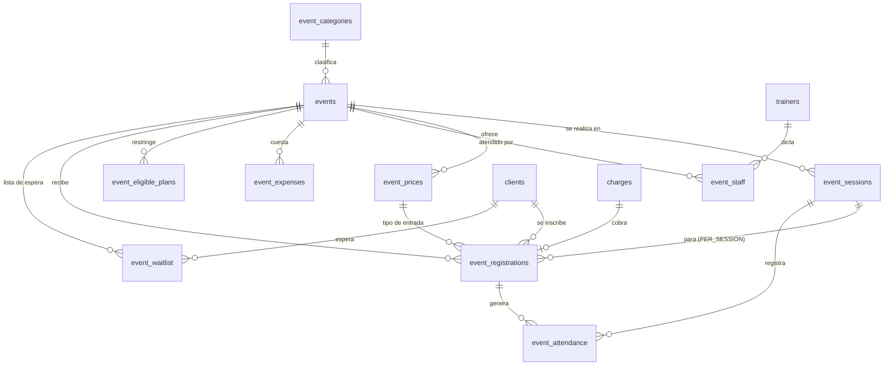
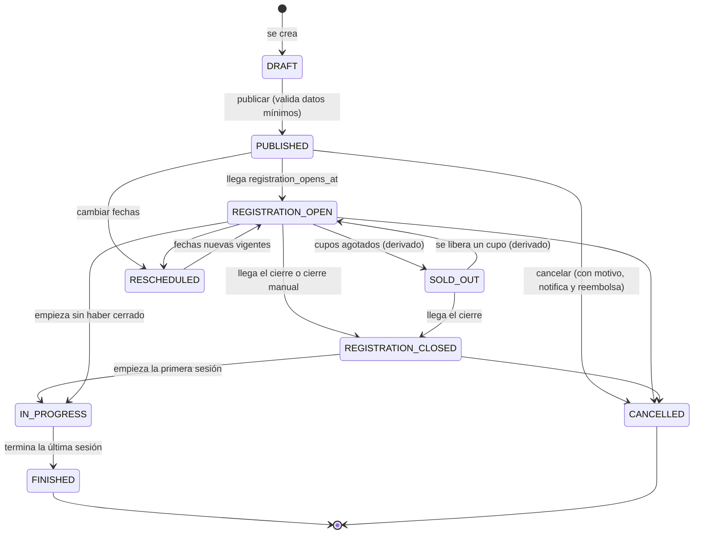
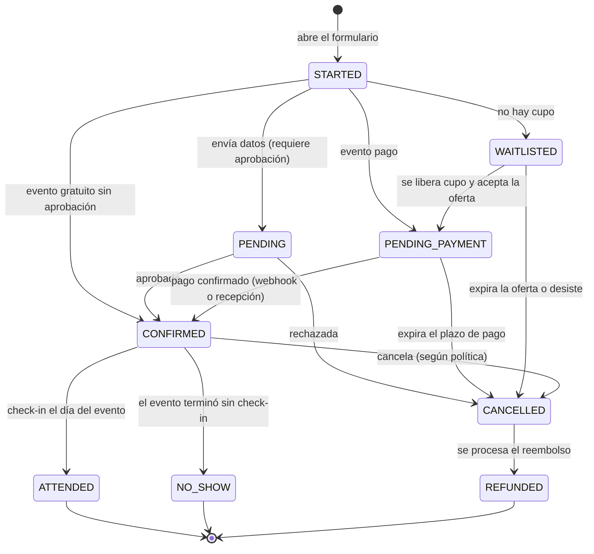
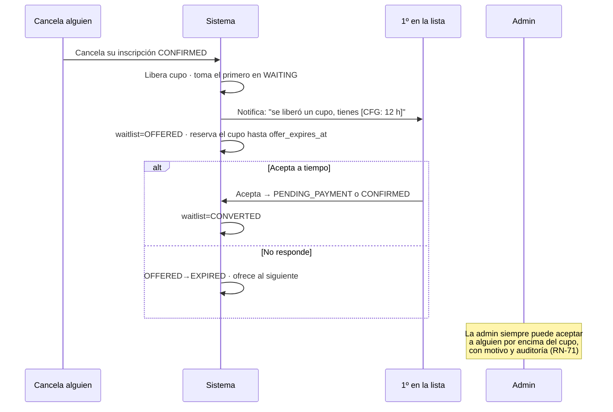
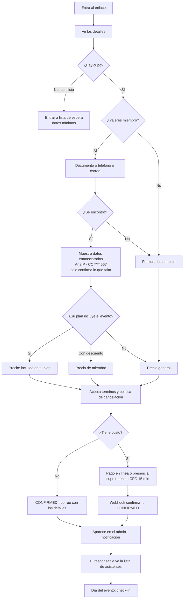

# 11 · Módulo de eventos y clases especiales

> Yoga, kickboxing, clases especiales, talleres, jornadas deportivas, eventos internos y abiertos.
> Gratuitos o pagos. Una fecha o recurrentes. Con página pública propia y compartible.

---

## 1. Decisiones estructurales

### 1.1 Un evento es un producto; una inscripción a evento es un contrato

Se aplica exactamente la misma separación que en planes/membresías: `events` es el producto,
`event_registrations` es la venta. La inscripción **congela** el precio, el tipo de entrada y las
condiciones (`price_snapshot`). Cambiar el precio de un evento no altera a quien ya se inscribió.

### 1.2 No se construye un universo paralelo de dinero ni de personas

Un evento **no** tiene su propia tabla de pagos ni su propia tabla de personas. Reutiliza:

- `clients` — el asistente es un cliente (aunque no sea miembro: se crea como `PROSPECTO`).
- `charges` + `payments` + `payment_allocations` — con `concept = 'EVENT'`.
- La detección de duplicados de [07-reglas-negocio.md](07-reglas-negocio.md) (RN-80→RN-83).
- `receipts`, `refunds`, `consents`, `audit_logs`.

Consecuencia práctica: quien se inscribe a *Yoga al atardecer* y luego compra una mensualidad **es la
misma persona**, con un solo historial. Esto es lo que convierte los eventos en un canal de captación
real y no en una lista suelta.

### 1.3 Evento ≠ sesión

| Caso | Modelado |
|---|---|
| Yoga al atardecer, un sábado | 1 `event` → 1 `event_session` |
| Kickboxing, martes y jueves durante 4 semanas | 1 `event` → 8 `event_sessions` |
| Taller de 3 días seguidos | 1 `event` → 3 `event_sessions`, inscripción al conjunto |
| Jornada deportiva con 4 actividades | 1 `event` → 4 `event_sessions`, inscripción por actividad |

Y de ahí sale el campo que decide todo el comportamiento:

**`registration_mode`**
- `WHOLE_EVENT` — se inscribe al evento completo. El cupo es del evento. *(taller, jornada)*
- `PER_SESSION` — se inscribe a fechas concretas. El cupo es de cada sesión. *(clase recurrente)*

Sin esta distinción, "recurrente" y "múltiples jornadas" exigirían rediseñar el módulo más adelante.

### 1.4 Los tipos de entrada existen desde el primer día

Aunque la v1 solo cree una entrada por evento, la tabla `event_prices` (tipos de entrada) está desde el
principio. Un evento gratuito es una entrada de precio `0`. Un evento con precio distinto para miembros
son dos filas. General y preferencial, mañana, son dos filas más. **Cero migración cuando llegue el
evento grande.**

### 1.5 Las categorías de actividad son datos

`event_categories` es un catálogo editable (Yoga, Kickboxing, Taller, Jornada, Evento interno…).
No hay un `enum` de tipos de actividad en el código.

---

## 2. Modelo de datos



### `event_categories`
`id` · `name` · `slug` · `color` · `icon` · `default_duration_minutes` · `is_active` · `sort_order`

### `events`

| Campo | Tipo | Nota |
|---|---|---|
| `id` · `slug` | | **`slug` único** → `mindfitnessclub.com.co/eventos/yoga-al-atardecer` |
| `public_token` | text | acceso por enlace para eventos no listados |
| `name` · `description` · `short_description` | | descripción larga en Markdown restringido |
| `category_id` | uuid | |
| `cover_image_key` | text | portada (S3) |
| `gallery` | jsonb | imágenes adicionales |
| `registration_mode` | enum | `WHOLE_EVENT` \| `PER_SESSION` |
| `recurrence` | jsonb NULL | regla usada para generar las sesiones (se guarda, no se recalcula) |
| `location_name` · `location_address` · `location_url` | | puede ser fuera del gimnasio |
| `capacity` | int NULL | cupo del evento (`WHOLE_EVENT`) |
| `waitlist_enabled` | bool | |
| `waitlist_capacity` | int NULL | |
| `audience` | enum | `PUBLIC` \| `MEMBERS_ONLY` \| `PLAN_RESTRICTED` |
| `min_age` · `max_age` | int NULL | |
| `requirements` | jsonb | lista de requisitos |
| `what_to_bring` | jsonb | lista de elementos que debe llevar |
| `registration_opens_at` · `registration_closes_at` | timestamptz NULL | |
| `cancellation_policy` | text | texto mostrado y aceptado al inscribirse |
| `refund_policy` | enum | `NONE` \| `FULL_UNTIL_DEADLINE` \| `PARTIAL` \| `CREDIT` |
| `refund_deadline_hours` | int NULL | |
| `status` | enum | ver §3 |
| `is_public` | bool | aparece en `/eventos` |
| `allows_online_payment` | bool | |
| `requires_approval` | bool | inscripción sujeta a revisión |
| `custom_form_schema` | jsonb NULL | 🔜 formularios personalizados |
| `financial_goal` | bigint NULL | meta de ingresos, para el reporte de rentabilidad |
| `rescheduled_from` | jsonb NULL | fechas originales cuando se reprograma |
| `cancelled_at` · `cancel_reason` | | |
| `published_at` · `created_by` | | |

### `event_sessions`
`id` · `event_id` · `sequence` · `starts_at` · `ends_at` · `capacity_override` NULL ·
`location_override` NULL · `trainer_override` NULL · `status` (`SCHEDULED`,`IN_PROGRESS`,`DONE`,`CANCELLED`,`RESCHEDULED`) ·
`notes` · `rescheduled_from_starts_at` NULL

### `event_prices` — tipos de entrada
`id` · `event_id` · `name` (`General`, `Preferencial`, `Miembro`, `Cortesía`) · `description` ·
`amount` bigint · `currency` · `audience` (`ANY`,`MEMBER`,`NON_MEMBER`,`PLAN`) · `eligible_plan_ids` jsonb NULL ·
`quantity_available` int NULL · `quantity_sold` int · `min_per_registration` · `max_per_registration` ·
`sales_start_at` · `sales_end_at` · `is_group` bool · `group_size` int NULL · `is_active` · `sort_order`

> Un evento gratuito = una fila con `amount = 0`. Un evento incluido en ciertos planes = una fila con
> `audience = PLAN` y `amount = 0`, más otra `NON_MEMBER` con precio. **La lógica no cambia.**

### `event_eligible_plans`
`event_id` · `plan_id` · `access` (`FREE`,`DISCOUNTED`,`ALLOWED`) · `discount_percent` NULL
*Resuelve "planes que pueden participar" y "clases grupales incluidas" del módulo de servicios.*

### `event_registrations`

| Campo | Nota |
|---|---|
| `id` · `reference` | referencia única legible (`EV-2026-0042`) |
| `event_id` · `event_session_id` NULL | la sesión solo en modo `PER_SESSION` |
| `event_price_id` | tipo de entrada elegido |
| `client_id` NULL | nulo hasta resolver la identidad |
| `membership_id` NULL | si el acceso vino de su plan |
| **`price_snapshot`** jsonb | 🔒 nombre del tipo de entrada, importe, condiciones, política de cancelación |
| `quantity` | entradas (grupal) |
| `amount` · `discount_amount` · `final_amount` | |
| `promo_code_id` NULL | 🔜 |
| `charge_id` NULL | enlaza con el módulo financiero |
| `status` | ver §4 |
| `is_member_at_registration` bool | congelado: sirve para el reporte de captación |
| `form_data` jsonb | datos capturados + respuestas del formulario personalizado |
| `custom_answers` jsonb | 🔜 |
| `source` | `PUBLIC_LINK`,`WHATSAPP`,`INSTAGRAM`,`ADMIN`,`WAITLIST` |
| `utm` jsonb · `ip` · `user_agent` | atribución del enlace compartido |
| `confirmed_at` · `cancelled_at` · `cancel_reason` · `refunded_at` | |
| `checked_in_at` NULL | atajo del check-in |
| `approved_by` NULL · `notes` | |
| `qr_code` text | 🔜 lectura de QR |

### `event_waitlist`
`id` · `event_id` · `event_session_id` NULL · `client_id` NULL · `contact_data` jsonb ·
`position` int · `status` (`WAITING`,`OFFERED`,`CONVERTED`,`EXPIRED`,`DECLINED`,`CANCELLED`) ·
`offered_at` · `offer_expires_at` · `notified_count` · `converted_registration_id` NULL · `created_at`

### `event_attendance`
`id` · `event_registration_id` · `event_session_id` · `checked_in_at` · `source` (`MANUAL`,`QR`,`BULK`) ·
`registered_by` · `status` (`ATTENDED`,`NO_SHOW`,`LATE`) · `notes`

### `event_staff`
`id` · `event_id` · `event_session_id` NULL · `trainer_id` NULL · `user_id` NULL · `external_name` NULL ·
`role` (`LEAD`,`SUPPORT`,`LOGISTICS`,`GUEST`) · `confirmed_at` NULL · `pay_mode` · `pay_amount` ·
`pay_percent` · `notes`
*Su tarifa alimenta la liquidación del entrenador — ver [13-finanzas.md](13-finanzas.md).*

### `event_expenses`
`id` · `event_id` · `expense_id` → apunta a la tabla general `expenses`. **Los gastos de evento no son
una tabla de gastos aparte**, son gastos normales etiquetados con el evento. Así la contabilidad cuadra.

### 🔜 Preparadas, vacías en la v1
`event_promo_codes` · `event_addons` (venta de productos adicionales) · `event_sponsors` ·
`event_form_fields` (formularios personalizados).

---

## 3. Estados del evento



> **`SOLD_OUT` es derivado**, igual que "próximo a vencer": es `cupos_disponibles <= 0`. No se almacena,
> por lo que jamás queda desincronizado cuando alguien cancela. Mismo principio que
> [00-resumen-ejecutivo.md](00-resumen-ejecutivo.md#4-estados-derivados-vs-estados-almacenados).

**Reglas de transición**
- `DRAFT → PUBLISHED` exige: nombre, categoría, al menos una sesión con fecha, cupo, al menos un tipo de entrada, política de cancelación y responsable asignado.
- `CANCELLED` obliga a decidir sobre el dinero recibido: reembolsar todo, dejar saldo a favor o nada (según `refund_policy`), y notifica a **todos** los inscritos y a la lista de espera.
- `RESCHEDULED` conserva las fechas originales en `rescheduled_from`, notifica a los inscritos y **[CFG]** puede abrir una ventana de cancelación sin penalidad.

## 4. Estados de la inscripción al evento



**Invariante:** solo `CONFIRMED`, `ATTENDED` y `PENDING_PAYMENT` **dentro de su ventana de retención**
ocupan cupo. `WAITLISTED` nunca ocupa cupo.

## 5. Cupos y lista de espera

### Cálculo del cupo
```
disponibles = capacity
            − CONFIRMED − ATTENDED
            − PENDING_PAYMENT con hold vigente
            − ofertas de lista de espera vigentes
```
Se calcula **dentro de la transacción con `SELECT … FOR UPDATE`** sobre la fila del evento o de la sesión.
Es la única forma de que dos personas que pulsan "Inscribirme" en el mismo segundo no ocupen el último cupo.

### Ciclo de la lista de espera



**Por qué oferta y no confirmación automática:** confirmar de oficio a quien lleva tres días esperando
llena el evento de gente que no aparece. La oferta con vencimiento convierte mejor y deja el cupo libre
para el siguiente si nadie responde.

## 6. Página pública del evento

`/eventos` — cartelera (solo `is_public` y en estado publicado)
`/eventos/[slug]` — página del evento
`/eventos/[slug]/inscripcion` — flujo
`/e/[public_token]` — enlace corto para eventos no listados (compartible por WhatsApp/Instagram)

**Contenido de la página:** portada · nombre y categoría · fecha, hora y duración · ubicación con mapa ·
responsable con foto · descripción · qué incluye · qué llevar · requisitos · edad mínima ·
**contador de cupos** ("quedan 4 cupos") · precio o "gratuito" · precio diferenciado para miembros ·
política de cancelación · fecha límite · botón principal · botón de compartir por WhatsApp.

**Metadatos sociales obligatorios:** `og:image` generada con la portada, `og:title`, `og:description`,
más JSON-LD `schema.org/Event`. Un enlace que se comparte por WhatsApp o Instagram **se ve como una
tarjeta con imagen**, o no se comparte. Es un requisito funcional, no un detalle técnico.

## 7. Flujo de inscripción



**Privacidad en el paso 4:** al buscar por documento **nunca** se devuelven los datos completos.
Se muestra `Ana P. · CC ***4567` para que confirme que es ella, y solo entonces se piden los faltantes.
Si no, el buscador del evento se convierte en una herramienta para extraer la base de clientes.

## 8. Pantallas administrativas

```
/admin/eventos                          Cartelera  [Borradores · Abiertos · En curso · Finalizados]
├─ /admin/eventos/nuevo                 Constructor por pasos
└─ /admin/eventos/[id]
   ├─ ?tab=resumen                      Cupos, inscritos, recaudo, rentabilidad
   ├─ ?tab=inscritos                    Lista, filtros, aceptar, cancelar, reembolsar, exportar
   ├─ ?tab=espera                       Cola ordenada, ofrecer cupo manualmente
   ├─ ?tab=asistencia                   Check-in del día (modo lista rápida)
   ├─ ?tab=finanzas                     Ingresos, gastos, costo del staff, margen  [OWNER]
   ├─ ?tab=sesiones                     Fechas, cancelar o reprogramar una
   └─ ?tab=difusion                     Enlace público, QR del enlace, texto listo para WhatsApp
/admin/eventos/categorias
```

**Constructor por pasos:** 1) Qué y para quién · 2) Cuándo y dónde · 3) Cupo y entradas ·
4) Responsables · 5) Condiciones y política · 6) Publicación (con vista previa de cómo se verá compartido).

**Lista de asistentes del entrenador** — vista simplificada en `/admin/eventos/[id]?tab=asistencia`:
nombre, foto, estado de pago **solo como ✅/⏳** (nunca importes), botón grande de check-in, buscador.
Funciona con el móvil en la mano y sin buena conexión (los datos se cargan una vez).

## 9. Preparado para eventos grandes (sin construirlo)

| Requisito futuro | Cómo queda listo |
|---|---|
| Varias categorías de entrada | `event_prices` desde el día uno |
| General / preferencial | Filas distintas en `event_prices` |
| Códigos promocionales | `event_promo_codes` creada, `promo_code_id` ya en la inscripción |
| Entradas grupales | `quantity`, `is_group`, `group_size` ya en el modelo |
| Patrocinadores | `event_sponsors` creada |
| Formularios personalizados | `custom_form_schema` + `custom_answers` (JSON Schema) |
| Lectura de QR | `event_registrations.qr_code` generado desde ya |
| Check-in masivo | `event_attendance.source = 'BULK'` + endpoint por lotes |
| Productos adicionales | `event_addons` → generan `charges` normales |
| Múltiples jornadas | `event_sessions` ya lo resuelve |
| Diferentes sedes | `location_id` en evento y sesión |
| Reportes financieros por evento | `event_expenses` + `charges.concept='EVENT'` → ya calculable |

---

**Anterior:** [10-fases-desarrollo.md](10-fases-desarrollo.md) · **Siguiente:** [12-servicios-y-entrenadores.md](12-servicios-y-entrenadores.md)
