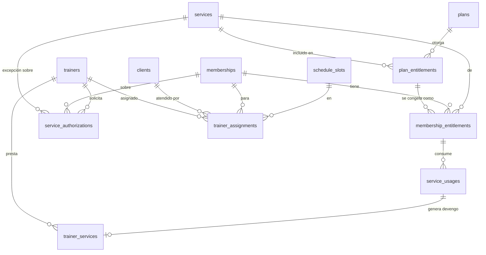

# 12 · Servicios contratados, control de acceso y entrenadores

> ⚠️ **Este documento modifica el modelo de planes de [06-modelo-datos.md](06-modelo-datos.md).**
> No es un módulo añadido: es un cambio en el núcleo. Debe entrar en la Fase 3, no después.

---

## 1. El problema y la decisión

El requisito es: *"no basta con mostrar que el cliente está activo; debe mostrarse qué incluye
exactamente su plan"*. Y las alertas que se piden lo confirman:

> "Cliente activo, pero su plan **no incluye** acompañamiento de entrenador"
> "Cliente **con sesión disponible**" / "Cliente **sin sesiones restantes**"

Ninguna de esas frases se puede calcular con el modelo anterior. `modality = 'SEMI_PERSONAL'` es una
**etiqueta de marketing**: no dice si incluye clases grupales, cuántas sesiones de acompañamiento quedan
ni qué horarios están autorizados.

### Decisión: catálogo de servicios + derechos (*entitlements*)

```
services            catálogo de lo que el gimnasio ofrece
   ↓
plan_entitlements   qué servicios incluye cada plan, con qué límites
   ↓  (al vender: se congela)
membership_entitlements   qué tiene ESTA persona, con SUS contadores
   ↓
La tarjeta del entrenador se lee directamente de aquí.
```

`plans.modality` **se conserva** como etiqueta visible al público. Los `entitlements` son la verdad
operativa. Un plan sin derechos declarados no se puede publicar.

**Lo que esto habilita, y antes era imposible:**
- Un plan mensual que incluye 4 sesiones de acompañamiento y clases grupales ilimitadas.
- Un plan personalizado sin acceso libre al gimnasio fuera de su horario.
- Un plan que incluye 2 eventos al mes sin costo.
- Vender una sesión suelta a alguien cuyo plan no la incluye, cobrarla y descontarla.
- Responder "¿esta persona puede recibir esto?" con un `sí`/`no` **calculado**, no interpretado.

---

## 2. Modelo de datos



### `services` — catálogo (editable desde Configuración)

| Campo | Nota |
|---|---|
| `id` · `code` · `name` · `description` | `GYM_ACCESS`, `SEMI_PERSONAL`, `PERSONAL_TRAINING`, `GROUP_CLASS`, `EVENT_ACCESS`, `ASSESSMENT`, `NUTRITION_PLAN`… |
| `kind` | `ACCESS` \| `TRAINING` \| `CLASS` \| `EVENT` \| `ADDON` |
| `unit` | `UNLIMITED` \| `SESSION` \| `HOUR` \| `CLASS` \| `MONTH` |
| `requires_trainer` | si el servicio implica acompañamiento (**clave para las alertas**) |
| `is_billable_standalone` · `standalone_price` | precio si se vende suelto o como excepción |
| `default_trainer_cost_mode` · `default_trainer_cost` | costo por defecto para la liquidación |
| `icon` · `color` · `is_active` · `sort_order` | presentación en la tarjeta del entrenador |

### `plan_entitlements` — qué incluye el plan
`id` · `plan_id` · `service_id` · `quantity` int NULL (nulo = ilimitado) ·
`period` (`TOTAL`,`DAY`,`WEEK`,`MONTH`) · `rollover` bool (¿lo no usado pasa al periodo siguiente?) ·
`restricted_to_slots` jsonb NULL · `requires_specific_trainer` bool · `notes` · `is_highlighted` (se muestra en la web)

### `membership_entitlements` — 🔒 congelado al vender
`id` · `membership_id` · `service_id` · **`snapshot`** jsonb (copia de la regla del plan) ·
`quantity_total` int NULL · `quantity_used` int · `quantity_reserved` int · `period` · `period_start` ·
`period_end` · `restricted_to_slots` jsonb · `trainer_id` NULL · `status` (`ACTIVE`,`EXHAUSTED`,`SUSPENDED`,`EXPIRED`) ·
`source` (`PLAN`,`ADDON`,`AUTHORIZATION`,`COURTESY`,`EVENT`)

> `source` permite **añadir derechos** a una membresía sin tocar el plan: una sesión extra comprada,
> una cortesía, una excepción aprobada. Cada uno con su propio contador y trazabilidad.

### `service_usages` — cada vez que se presta un servicio
`id` · `membership_entitlement_id` NULL · `client_id` · `membership_id` NULL · `service_id` ·
`trainer_id` NULL · `attendance_id` NULL · `event_registration_id` NULL · `schedule_slot_id` NULL ·
`occurred_at` · `business_date` · `quantity` · `was_within_entitlement` bool ·
`authorization_id` NULL · `charge_id` NULL (si se cobró aparte) · `registered_by` · `notes`

**Esta tabla es la bisagra del sistema.** Alimenta a la vez: el contador de sesiones del cliente, la
liquidación del entrenador ([13-finanzas.md](13-finanzas.md)) y el reporte de rentabilidad por servicio.

### `service_authorizations` — excepciones controladas
`id` · `client_id` · `membership_id` NULL · `service_id` · `requested_by` (entrenador) · `requested_at` ·
`reason` · `status` (`REQUESTED`,`APPROVED`,`REJECTED`,`APPLIED`,`EXPIRED`,`CANCELLED`) ·
`decided_by` · `decided_at` · `decision_notes` ·
`effect_charge` bool · `charge_amount` · `charge_id` NULL ·
`effect_consume_session` bool · `effect_grant_entitlement` bool ·
`valid_until` · `applied_at` · `service_usage_id` NULL

---

## 3. Motor de decisión de acceso

Función pura, sin I/O, 100 % testeable: `resolveAccess(client, membership, entitlements, service, now)`

```
1. ¿Existe membresía?                → NO_MEMBERSHIP
2. ¿Estado ACTIVE?                   → EXPIRED · PAUSED · PENDING_PAYMENT
3. ¿Dentro de gracia?                → IN_GRACE (permite, avisa)
4. ¿El plan incluye este servicio?   → SERVICE_NOT_INCLUDED
5. ¿Quedan unidades?                 → NO_SESSIONS_LEFT
6. ¿Horario autorizado?              → OUTSIDE_SCHEDULE
7. ¿Entrenador correcto?             → ASSIGNED_TO_OTHER_TRAINER
8. ¿Hay autorización vigente?        → EXCEPTIONAL_ACCESS
                                     → GRANTED
```

Salida tipada:
```ts
type AccessDecision = {
  outcome: 'GRANTED' | 'GRANTED_WITH_WARNING' | 'REQUIRES_AUTHORIZATION' | 'DENIED'
  reasonCode: AccessReasonCode          // uno de los de arriba
  message: string                        // frase lista para mostrar, en español
  severity: 'ok' | 'info' | 'warning' | 'error'
  suggestedActions: Action[]             // "Solicitar autorización" · "Cobrar sesión" · "Renovar"
}
```

**Los mensajes viven en un único mapa `reasonCode → texto`.** Las frases que pediste salen de ahí:

| Código | Mensaje mostrado | Severidad |
|---|---|---|
| `GRANTED` | "Cliente activo con acceso a {servicio}" | 🟢 |
| `SERVICE_NOT_INCLUDED` | "Cliente activo, pero su plan no incluye acompañamiento de entrenador" | 🟡 |
| `ASSIGNED_TO_OTHER_TRAINER` | "Cliente asignado a {nombre}" | 🟡 |
| `EXPIRED` | "Membresía vencida el {fecha}" | 🔴 |
| `PENDING_PAYMENT` | "Cliente con pago pendiente" | 🔴 |
| `NO_MEMBERSHIP` | "No se encontró una membresía activa" | 🔴 |
| `SESSIONS_AVAILABLE` | "Cliente con {n} sesiones disponibles" | 🟢 |
| `NO_SESSIONS_LEFT` | "Cliente sin sesiones restantes" | 🟡 |
| `IN_GRACE` | "En periodo de gracia · vence en {n} días" | 🟡 |
| `EXCEPTIONAL_ACCESS` | "Acceso excepcional autorizado por {nombre}" | 🔵 |

Cambiar la redacción es editar un archivo de textos. Añadir un caso es añadir un código y una prueba.

---

## 4. Tarjeta rápida del entrenador

**Endpoint:** `GET /api/v1/access-card?q={documento|teléfono|nombre|código}&serviceId={opcional}`
**Permiso:** `access_card.read` · **Serialización sin un solo importe.**

```
┌──────────────────────────────────────────┐
│  ●  ANA MARÍA PÉREZ            CC 1020…  │  ← foto + nombre grande
│                                          │
│  ┌────────────────────────────────────┐  │
│  │ 🟢  ACTIVO                         │  │  ← banda de color, legible a 1 m
│  │     Vence el 28 de agosto (24 d.)  │  │
│  └────────────────────────────────────┘  │
│                                          │
│  PLAN MENSUAL PREMIUM        [TEMP]      │
│                                          │
│  QUÉ INCLUYE                             │
│  ✅ Acceso libre al gimnasio             │
│  ✅ Entrenamiento semipersonalizado      │
│     3 de 8 sesiones usadas · quedan 5    │  ← barra de progreso
│  ✅ Clases grupales ilimitadas           │
│  ❌ Entrenamiento personalizado          │
│                                          │
│  ENTRENADOR   Carolina M.  (tú)          │
│  HORARIOS     L-M-V · 6:00–8:00 a. m.    │
│                                          │
│  ⚠️ Fuera de su horario autorizado       │  ← alertas contextuales
│                                          │
│  [ ✓ Registrar sesión ]                  │  ← acción principal
│  [ Solicitar autorización ]              │
└──────────────────────────────────────────┘
```

**Reglas de la tarjeta**
1. **Cero cifras de dinero.** Ni precio, ni saldo, ni deuda. "Pago pendiente" es un estado, no un importe.
2. **Una sola pantalla, sin desplazamiento**, en un teléfono de 360 px.
3. El estado se lee **antes** que el nombre: color + icono + palabra.
4. Nada de tablas. Lista con ✅/❌, no una matriz.
5. La acción principal es siempre la más probable: registrar la sesión.
6. Funciona con conexión mala: la búsqueda es un único `GET`, la respuesta pesa poco, y el registro de
   sesión es optimista con reversa.

**Búsqueda:** documento (exacto, prioritario), teléfono, nombre, código interno, `access_code` para QR 🔜.
Si hay varias coincidencias, muestra una lista compacta con foto, nombre y documento enmascarado.

---

## 5. Excepciones: cuando se presta algo no incluido

```mermaid
sequenceDiagram
    actor T as Entrenador
    participant S as Sistema
    actor A as Administradora

    T->>S: Tarjeta muestra "su plan no incluye personalizado"
    T->>S: [Solicitar autorización] · motivo
    S->>A: 🔔 Notificación URGENTE (centro + correo)
    S->>T: "Solicitud enviada"
    alt Modo estricto [CFG]
        T->>T: Espera la respuesta
    else Modo operativo [CFG: por defecto]
        S->>T: "Puedes prestar el servicio; queda pendiente de aprobación"
        T->>S: Presta el servicio · registra el uso
    end
    A->>S: Aprueba · define efecto
    Note over S: Efectos combinables:<br/>• generar cobro adicional<br/>• descontar una sesión<br/>• otorgar derecho puntual<br/>• sin costo (cortesía)
    S->>S: service_authorization=APPLIED<br/>service_usage · charge? · audit_log
    S->>T: 🔔 "Autorización aprobada"
```

**Por qué el modo operativo es el predeterminado:** el entrenador está con el cliente delante. Si el
sistema exige esperar la aprobación, el servicio se presta igual y **fuera del sistema** — que es
exactamente el problema que se quiere resolver ("evita que los servicios extraordinarios se pierdan o
se presten sin control"). Mejor registrarlo y aprobarlo después que perderlo.

Toda solicitud sin resolver en `[CFG: 48 h]` escala a notificación crítica y aparece en el dashboard.

---

## 6. Asignación de entrenadores

Las siete formas de asignación pedidas se resuelven con **una sola tabla polimórfica**, no con siete.

### `trainer_assignments` *(reemplaza a `client_assignments`)*

| Campo | Nota |
|---|---|
| `id` · `trainer_id` | |
| `scope` | `CLIENT` \| `MEMBERSHIP` \| `SLOT` \| `PLAN` \| `EVENT` \| `TEMPORARY` |
| `client_id` NULL · `membership_id` NULL · `schedule_slot_id` NULL · `plan_id` NULL · `event_id` NULL | según el `scope` |
| `role` | `PRIMARY` \| `SUPPORT` \| `SUBSTITUTE` |
| `service_id` NULL | asignación para un servicio concreto |
| `starts_at` · `ends_at` NULL | `ends_at` nulo = indefinida |
| `sessions_total` · `sessions_delivered` | cuando la asignación es por número de sesiones |
| `status` | `ACTIVE` \| `SCHEDULED` \| `ENDED` \| `CANCELLED` |
| `replaces_assignment_id` NULL | suplencias |
| `notes` · `created_by` | |

**Un `CHECK` garantiza que el campo correspondiente al `scope` no sea nulo.**
Varios entrenadores para una misma membresía = varias filas con distinto `role` o `service_id`.

### Precedencia — la parte difícil

Ante *"¿quién atiende a esta persona ahora mismo?"*, se resuelve en este orden y **gana el primero**:

```
1. TEMPORARY vigente (suplencia)          ← lo más específico en el tiempo
2. MEMBERSHIP  (entrenador de su contrato)
3. CLIENT      (entrenador fijo de la persona)
4. SLOT        (quien dicta su franja)
5. PLAN        (entrenador por defecto del plan)
6. ninguno     → "sin entrenador asignado"
```

Función pura `resolveTrainer(context)`, con pruebas para cada nivel y para los empates.
La tarjeta muestra siempre **de dónde viene** la asignación ("por su horario", "asignado directamente"),
porque un entrenador que no entiende por qué le aparece un cliente deja de confiar en el sistema.

---

## 7. Dashboard del entrenador

`/admin` con rol `TRAINER` muestra una pantalla distinta, no la de las propietarias.

```
┌─────────────────────────────────────┐
│ Hola, Carolina · martes 4 de agosto │
├─────────────────────────────────────┤
│ [ 🔍  Buscar cliente…          ⌘K ] │  ← lo primero, siempre
├─────────────────────────────────────┤
│  6:00–8:00  Semipersonalizado       │
│  ●●●●●○○○   5 de 8 · 3 marcados     │
│  ─────────────────────────────────  │
│  5:00–7:00 p.m.  Kickboxing (evento)│
│  12 inscritos · empieza en 6 h      │
├─────────────────────────────────────┤
│ ⚠️ 2 autorizaciones pendientes    › │
│ ⏰ 3 de tus clientes vencen esta    │
│    semana                         › │
│ 📋 Liquidación de julio disponible › │
├─────────────────────────────────────┤
│ MIS CLIENTES (18)                 › │
│ Sesiones prestadas este mes: 42     │
└─────────────────────────────────────┘
```

**Contenido:** clientes asignados · esperados hoy (inscritos en sus franjas de hoy) · horarios del día ·
eventos asignados · sesiones pendientes por prestar · clientes próximos a vencer (**sin importes**) ·
alertas de plan · asistencias que registró · servicios prestados · solicitudes de autorización.

**Lo que nunca aparece:** ingresos del gimnasio, cartera, gastos, pagos de otros entrenadores,
utilidad, configuración. Su propia liquidación **sí** — es su dinero
(ver [13-finanzas.md](13-finanzas.md#7-qué-ve-el-entrenador-de-su-propio-dinero)).

---

## 8. Impacto sobre lo ya diseñado

| Documento | Cambio |
|---|---|
| [06-modelo-datos.md](06-modelo-datos.md) | `client_assignments` → `trainer_assignments`. Nuevas: `services`, `plan_entitlements`, `membership_entitlements`, `service_usages`, `service_authorizations`. |
| Plan | `modality` pasa a ser etiqueta pública; los derechos son la verdad. Un plan sin derechos no se publica. |
| Membresía | Al crearla se materializan sus `membership_entitlements` dentro de la misma transacción. |
| Asistencia | El check-in consulta `resolveAccess` y puede generar un `service_usage`. |
| Renovación | Los contadores se reinician según `period` y `rollover`. |
| Pausa | Los derechos pasan a `SUSPENDED` y se reanudan con el periodo desplazado. |
| Fase 3 | **Crece**: incorpora servicios y derechos. Es la base de todo lo demás. |

---

**Anterior:** [11-modulo-eventos.md](11-modulo-eventos.md) · **Siguiente:** [13-finanzas.md](13-finanzas.md)
