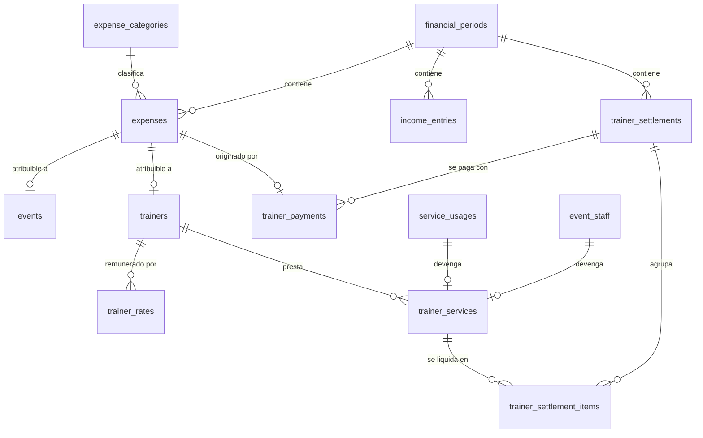
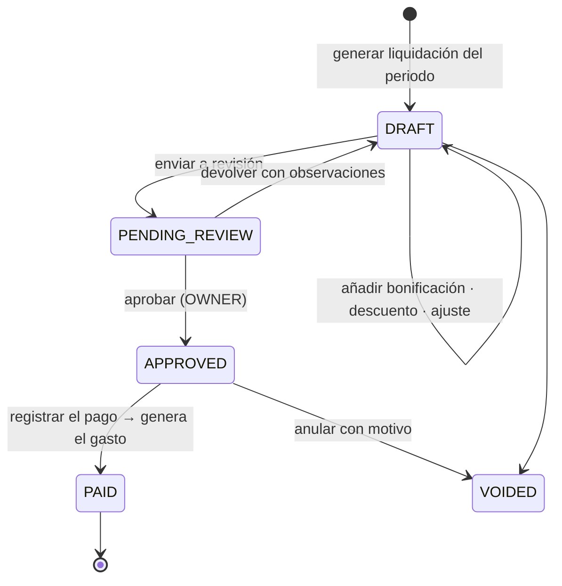

# 13 · Finanzas: ingresos, gastos, entrenadores y rentabilidad

> Pasar de "registrar los pagos de los clientes" a "saber cuánto entra, cuánto cuesta operar y qué es
> rentable". Esto convierte la plataforma en una herramienta de decisión, no solo de registro.

---

## 1. Las tres decisiones que evitan que los números mientan

### 1.1 Una sola fuente por tipo de movimiento — prohibido contar dos veces

El riesgo número uno de este módulo es duplicar ingresos: registrar el pago de una mensualidad **y
además** anotarla como "ingreso manual". Los números dejarían de servir en la primera semana.

```
INGRESOS                                    EGRESOS
├─ payments (clientes)  ← automático        └─ expenses  ← único origen
└─ income_entries       ← SOLO lo que no
                          proviene de un
                          cliente del sistema
```

**Invariante `RN-140`:** un `income_entry` **no puede** tener `charge_id` ni `payment_id`. Si el dinero
viene de un cliente, se registra como pago. Se valida en base de datos, no solo en la UI.

Los reportes leen una **vista unificada** `financial_movements` que hace la unión con `direction`
(`IN`/`OUT`), `source_type` y `source_id`. Una sola consulta para el flujo de caja, sin doble conteo.

### 1.2 Caja vs. causación — se elige una y se dice cuál

`payments.paid_at` es **caja** (cuándo entró el dinero). `charges.due_date` es **causación** (a qué
periodo corresponde). No son lo mismo: una mensualidad de agosto cobrada el 28 de julio.

**Decisión por defecto: todos los reportes son de CAJA**, porque es lo que las propietarias necesitan
para decidir. Cada reporte lleva un selector visible `Caja | Causación` y el encabezado dice cuál está
aplicado. Nunca se muestra una cifra sin decir qué criterio usa.

### 1.3 Margen de contribución, no "utilidad" inventada

Repartir el arriendo entre planes con una fórmula arbitraria produce un número que parece exacto y no
lo es. Por eso:

```
Ingresos del servicio
− Costos DIRECTOS (entrenador, gastos del evento, comisión de pasarela)
─────────────────────────────────
= MARGEN DE CONTRIBUCIÓN          ← esto se muestra por plan, evento, entrenador y horario

Suma de márgenes de contribución
− Costos FIJOS (arriendo, servicios, software, nómina fija)
─────────────────────────────────
= RESULTADO DEL PERIODO           ← esto se muestra solo a nivel global
```

**[CFG]** Se puede activar el prorrateo de costos fijos (por participación en ingresos o por horas de
uso), pero está **apagado por defecto** y, si se activa, la cifra se rotula como *estimada*.

---

## 2. Modelo de datos



### `expense_categories`
`id` · `code` · `name` · `parent_id` NULL (jerarquía) · `nature` (`FIXED`,`VARIABLE`,`DIRECT_EVENT`,`DIRECT_TRAINER`) ·
`is_active` · `sort_order`

Semilla `[TEMP]`: *Pago de entrenadores · Honorarios · Nómina · Arriendo · Servicios públicos ·
Mantenimiento · Equipos · Publicidad · Software · Insumos · Gastos de eventos · Transporte ·
Comisiones de pasarela · Reembolsos · Otros*.
La columna `nature` es la que decide si el gasto entra en el margen de contribución o en los costos fijos.

### `expenses`

| Campo | Nota |
|---|---|
| `id` · `category_id` · `description` | |
| `amount` bigint · `currency` · `tax_amount` NULL | |
| `expense_date` · `due_date` NULL | causación y vencimiento |
| `paid_at` NULL | caja |
| `supplier_name` · `supplier_document` NULL | proveedor o beneficiario |
| `payment_method_id` NULL | mismo catálogo que los pagos de clientes |
| `receipt_key` NULL | comprobante en S3 |
| `event_id` NULL · `trainer_id` NULL · `membership_id` NULL | atribución para rentabilidad |
| `trainer_payment_id` NULL | si nació de una liquidación |
| `financial_period_id` | periodo contable |
| `recurrence` jsonb NULL | gastos recurrentes (arriendo, software) |
| `parent_expense_id` NULL | instancia generada por la recurrencia |
| `status` | `SCHEDULED`,`PENDING`,`PAID`,`PARTIALLY_PAID`,`OVERDUE`,`VOIDED` |
| `approved_by` NULL · `approved_at` | **[CFG]** aprobación obligatoria sobre `expenses.approval_threshold` |
| `created_by` · `notes` · `voided_at` · `void_reason` | |

**Estados del gasto** — `OVERDUE` es derivado (`due_date < hoy AND status ∈ {PENDING, PARTIALLY_PAID}`),
igual que en el resto del sistema. Los gastos **no se borran**: se anulan con motivo.

### `income_entries` — ingresos que no vienen de un cliente
`id` · `category` · `description` · `amount` · `received_at` · `payment_method_id` · `reference` ·
`receipt_key` NULL · `event_id` NULL · `financial_period_id` · `registered_by` · `notes` · `voided_at`
**Constraint:** sin `client_id`, sin `charge_id`, sin `payment_id` (RN-140).

### `financial_periods`
`id` · `year` · `month` · `starts_on` · `ends_on` · `status` (`OPEN`,`CLOSING`,`CLOSED`,`LOCKED`) ·
`closed_by` · `closed_at` · `totals_snapshot` jsonb · `notes`

> **Cerrar un periodo congela sus cifras.** Con el periodo cerrado no se registran ni modifican
> movimientos con fecha dentro de él; hay que reabrirlo (permiso exclusivo de `OWNER` + auditoría).
> Sin esto, el reporte de mayo cambia en septiembre y nadie vuelve a confiar en un número.

---

## 3. Remuneración de entrenadores

### `trainer_rates` — tarifas versionadas, nunca editadas

`id` · `trainer_id` · `mode` · `amount` NULL · `percent` NULL · `service_id` NULL · `plan_id` NULL ·
`event_id` NULL · `min_guarantee` NULL · `valid_from` · `valid_until` NULL · `priority` int ·
`notes` · `created_by`

**Modos** (`mode`): `FIXED_MONTHLY` · `PER_HOUR` · `PER_CLASS` · `PER_SESSION` · `PER_CLIENT` ·
`PERCENT_MEMBERSHIP` · `PERCENT_EVENT` · `SPECIAL` · (mixto = varias filas con distinta `priority`).

> **Corregir una tarifa nunca se hace con `UPDATE`.** Se cierra la vigente (`valid_until`) y se crea otra.
> Igual que los precios de los planes: lo ya devengado no cambia porque hoy se acuerde otra tarifa.
> El pago mixto "fijo + variable" son simplemente dos filas vigentes a la vez.

### `trainer_services` — el devengo

Cada servicio efectivamente prestado genera una fila **con el importe congelado en ese momento**:

`id` · `trainer_id` · `kind` (`SESSION`,`CLASS`,`HOUR`,`EVENT`,`CLIENT_MONTH`,`FIXED`,`BONUS`,`ADJUSTMENT`) ·
`service_usage_id` NULL · `event_staff_id` NULL · `attendance_id` NULL · `schedule_slot_id` NULL ·
`client_id` NULL · `membership_id` NULL · `occurred_at` · `business_date` · `quantity` ·
`rate_id` · **`rate_snapshot` jsonb** · `computed_amount` bigint ·
`status` (`PENDING`,`SETTLED`,`PAID`,`VOIDED`,`DISPUTED`) · `settlement_item_id` NULL ·
`created_by` (nulo = automático) · `notes`

**Origen automático:** un `service_usage`, un `event_staff` de un evento realizado, una franja dictada.
**Origen manual:** bonificaciones, ajustes, servicios fuera de sistema (con permiso).

### El caso delicado: pago por porcentaje

Si un entrenador cobra el 30 % de una membresía y ese pago **se anula**, ¿qué pasa con su devengo?

**Decisión [CFG] `trainer_percent_basis`, valor por defecto `COLLECTED`:**

| Base | Cuándo devenga | Efecto de una anulación |
|---|---|---|
| **`COLLECTED`** *(por defecto)* | Cuando el dinero **entra** | Genera un `ADJUSTMENT` negativo en el periodo siguiente |
| `BILLED` | Cuando se emite el cargo | El entrenador cobra por dinero que quizá nunca entró |

Con `COLLECTED`, un pago parcial devenga proporcionalmente. Es lo justo para ambas partes y es lo que
hace que la liquidación cuadre con la caja.

---

## 4. Liquidación

### `trainer_settlements`
`id` · `trainer_id` · `financial_period_id` · `period_start` · `period_end` ·
`gross_amount` · `bonuses` · `deductions` · `adjustments` · `net_amount` ·
`status` (`DRAFT`,`PENDING_REVIEW`,`APPROVED`,`PAID`,`VOIDED`) ·
`generated_by` · `reviewed_by` · `approved_by` · `approved_at` · `paid_at` ·
`trainer_acknowledged_at` NULL · `notes` · `snapshot` jsonb

### `trainer_settlement_items`
`id` · `settlement_id` · `trainer_service_id` NULL · `type` · `description` · `quantity` ·
`unit_amount` · `amount` · `is_manual` · `created_by`

### `trainer_payments`
`id` · `settlement_id` · `trainer_id` · `amount` · `paid_at` · `payment_method_id` · `reference` ·
`receipt_key` · `expense_id` → **crea automáticamente el gasto**, para que no haya que registrarlo dos veces ·
`registered_by` · `notes` · `voided_at`

### Flujo



**Reglas**
- Generar una liquidación **congela** los `trainer_services` incluidos (`SETTLED`): dejan de ser editables.
- Un servicio prestado solo puede pertenecer a **una** liquidación (constraint de unicidad).
- Aprobar exige `OWNER`. Quien la generó no puede aprobarla si es otro rol.
- Registrar el pago crea el `expense` en la categoría *Pago de entrenadores*, atado al periodo.
- Anular una liquidación pagada exige motivo y devuelve los servicios a `PENDING`.
- El entrenador puede **ver y acusar recibo** de su liquidación, no editarla.

---

## 5. Rentabilidad

### Por evento — el caso del enunciado

```
EVENTO · Yoga al atardecer  ·  15 de agosto
────────────────────────────────────────────
Inscritos              20
Pagaron                18        (2 pendientes)
Asistieron             17

INGRESOS
  Entradas cobradas             $ 900.000     [TEMP]
  Pendiente por cobrar          $ 100.000
                                ─────────
  Recaudado                     $ 900.000

COSTOS DIRECTOS
  Entrenador (Carolina M.)      $ 200.000
  Publicidad                    $  80.000
  Logística                     $  50.000
  Comisiones de pasarela        $  31.500
                                ─────────
                                $ 361.500

MARGEN DE CONTRIBUCIÓN          $ 538.500   (59,8 %)
Margen por asistente            $  31.676
────────────────────────────────────────────
⚠ 2 inscritos sin pagar por $100.000 → ir a Cartera
```

Todo se calcula desde datos que ya existen: `charges.concept='EVENT'` + `event_expenses` +
`trainer_services` con `event_staff_id`. **No hay captura manual de rentabilidad.**

### Otros cortes disponibles

| Reporte | Ingresos | Costos directos |
|---|---|---|
| **Por plan** | Pagos de membresías de ese plan | Costo de entrenador imputado a esas membresías |
| **Por entrenador** | Ingresos de sus clientes y eventos | Lo devengado por él |
| **Por horario** | Ingresos de las membresías inscritas en la franja | Costo de dictar la franja |
| **Por servicio** | Ingresos atribuibles al servicio | `trainer_services` de ese servicio |
| **Por cliente** | Todo lo pagado históricamente | Costo directo atribuible |

**Costo promedio por cliente activo** = costos fijos del periodo ÷ clientes activos promedio.
**Ingreso promedio por cliente (ARPU)** = ingresos ÷ clientes activos promedio.
Ambos con su fórmula visible al pasar el cursor: una cifra sin fórmula no se puede discutir.

### Comisiones de pasarela

Cada pago en línea confirmado genera automáticamente un `expense` en *Comisiones de pasarela*,
calculado con la fórmula configurable del proveedor **[CFG]** (`% + fijo`) y conciliado contra el
extracto real. Sin esto, el margen de los eventos pagos aparece inflado.

---

## 6. Pantallas

```
/admin/finanzas
├─ ?tab=resumen         Flujo de caja del mes, entradas vs. salidas, comparativo
├─ ?tab=ingresos        Pagos + ingresos manuales, filtros, exportación
├─ ?tab=gastos          Listado, registrar, aprobar, recurrentes, adjuntos
├─ ?tab=periodos        Cierre mensual, estado de cada periodo
└─ ?tab=rentabilidad    Por plan · evento · entrenador · horario · servicio
/admin/finanzas/gastos/nuevo
/admin/entrenadores/[id]?tab=finanzas       Tarifas, devengado, saldo
/admin/liquidaciones                        Bandeja  [Borrador · Revisión · Aprobadas · Pagadas]
└─ /admin/liquidaciones/[id]                Detalle línea a línea, aprobar, pagar
```

**Registrar un gasto tiene que costar menos de 30 segundos desde el teléfono**, con foto del recibo
desde la cámara. Si cuesta más, no se registra, y sin gastos registrados no hay rentabilidad que valga.

---

## 7. Qué ve el entrenador de su propio dinero

Sí ve: sus servicios prestados, su acumulado del periodo, sus liquidaciones (con detalle línea a línea),
lo pagado y su saldo pendiente. Puede acusar recibo y reportar una inconformidad (`DISPUTED`).

No ve: ingresos del gimnasio, cartera, gastos generales, pagos de otros entrenadores, utilidad,
rentabilidad, tarifas de otros.

**Por qué sí lo suyo:** es su remuneración. Ocultársela genera exactamente las discusiones de WhatsApp
y planilla que el sistema debe eliminar. La transparencia sobre lo propio reduce fricción; sobre lo
ajeno la aumenta.

---

**Anterior:** [12-servicios-y-entrenadores.md](12-servicios-y-entrenadores.md) · **Siguiente:** [14-notificaciones.md](14-notificaciones.md)
