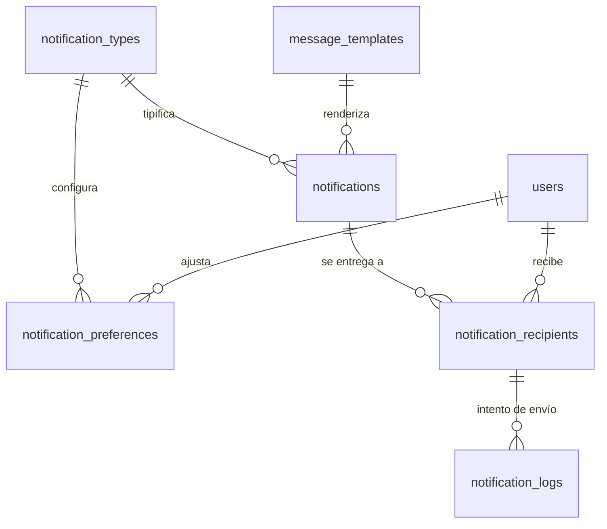

# 14 · Centro de notificaciones

> Un centro interno de avisos, no solo correos. Con prioridades, responsables, canales configurables y
> —lo más importante— **sin ruido**.

---

## 1. La decisión que define este módulo

Un sistema de notificaciones fracasa siempre por la misma razón: **satura**. A la tercera semana nadie
las lee, y entonces la notificación crítica se pierde entre 40 informativas. Por eso el diseño se
organiza alrededor de tres mecanismos de contención, no alrededor del envío:

| Mecanismo | Qué hace |
|---|---|
| **`dedupe_key`** | La misma notificación no se genera dos veces. Único por clave dentro de una ventana. |
| **Resumen (digest)** | Lo `INFO` se agrupa en un resumen diario. Solo `IMPORTANT+` interrumpe. |
| **Ciclo de vida** | Una notificación se **resuelve**, no solo se lee. Lo resuelto desaparece; lo pendiente insiste. |

### El otro pilar: notificación ≠ destinatario

Un mismo hecho ("pago fallido de Ana") va a dos propietarias. Cada una lo lee, lo pospone o lo resuelve
por separado — pero **el hecho es uno solo**. Por eso el modelo separa `notifications` (el hecho) de
`notification_recipients` (el estado de cada persona frente a él). Cuando una lo resuelve, se marca
resuelto para todas, con el nombre de quien lo hizo. Así dos personas no persiguen el mismo problema.

### Se generan dentro de la transacción, se envían fuera

La notificación se escribe en el `outbox` **en la misma transacción** que el hecho que la origina. Si
la operación falla, no hay aviso fantasma; si tiene éxito, el aviso está garantizado. El envío por
correo o WhatsApp ocurre después, con reintentos, sin poder bloquear la operación de negocio.

---

## 2. Modelo de datos



### `notification_types` — catálogo (semilla en código, configurable en la UI)
`id` · `code` · `name` · `description` · `group` (`CLIENTS`,`EVENTS`,`TRAINERS`,`ADMIN`,`SYSTEM`) ·
`default_priority` · `default_channels` jsonb · `default_roles` jsonb (quién lo recibe por defecto) ·
`is_resolvable` bool · `is_assignable` bool · `digest_eligible` bool · `template_id` NULL ·
`dedupe_window_minutes` · `is_active`

### `notifications` — el hecho
`id` · `type_code` · `priority` (`INFO`,`IMPORTANT`,`URGENT`,`CRITICAL`) · `title` · `body` ·
`entity_type` · `entity_id` · `link` · `data` jsonb (variables para renderizar) ·
**`dedupe_key`** (único junto con la ventana) · `status` (`OPEN`,`RESOLVED`,`SNOOZED`,`EXPIRED`,`CANCELLED`) ·
`assigned_to` NULL · `resolved_by` NULL · `resolved_at` · `resolution_note` ·
`expires_at` NULL · `created_by` NULL (nulo = automática) · `created_at`

### `notification_recipients` — el estado de cada persona
`id` · `notification_id` · `user_id` · `read_at` NULL · `seen_at` NULL · `snoozed_until` NULL ·
`dismissed_at` NULL · `channels_sent` jsonb

### `notification_preferences` — por usuario y tipo
`id` · `user_id` · `type_code` · `in_app` bool · `email` bool · `whatsapp` bool 🔜 · `push` bool 🔜 ·
`digest_only` bool · `min_priority` · `quiet_hours_start` · `quiet_hours_end` · `is_muted`

> **Horario silencioso:** nada que no sea `CRITICAL` interrumpe fuera del horario configurado.
> Un aviso de "nueva inscripción" a las 11 de la noche enseña a silenciar la aplicación entera.

### `notification_logs` — trazabilidad del envío
`id` · `notification_id` · `user_id` · `channel` · `status` (`QUEUED`,`SENT`,`DELIVERED`,`FAILED`,`SKIPPED`) ·
`provider_message_id` · `error` · `attempt` · `sent_at`
*`SKIPPED` guarda el motivo: silenciado, horario silencioso, agrupado en resumen, sin canal disponible.*

---

## 3. Catálogo de notificaciones

Prioridad por defecto · **Destinatarios:** `O` propietaria · `R` recepción · `T` entrenador (el implicado).

### Clientes e inscripciones
| Código | Prioridad | Dest. |
|---|---|---|
| `client.created` | INFO | O R |
| `registration.incomplete` | INFO | R |
| `registration.pending_approval` | IMPORTANT | O R |
| `payment.received` | INFO | O R |
| `payment.failed` | **URGENT** | O R |
| `payment.pending` | IMPORTANT | R |
| `membership.expiring_soon` | IMPORTANT | R T |
| `membership.expired` | IMPORTANT | O R T |
| `client.plan_change_requested` | IMPORTANT | O |

### Eventos
| Código | Prioridad | Dest. |
|---|---|---|
| `event.registration_created` | INFO | O · responsable |
| `event.almost_full` (**[CFG]** ≥80 %) | IMPORTANT | O |
| `event.sold_out` | IMPORTANT | O |
| `event.waitlist_joined` | INFO | O |
| `event.registration_cancelled` | IMPORTANT | O · responsable |
| `event.payment_pending` | IMPORTANT | R |
| `event.upcoming` (**[CFG]** 24 h antes) | IMPORTANT | O R T |
| `event.rescheduled` | URGENT | O R T |
| `event.staff_unconfirmed` | **URGENT** | O |
| `event.rule_violation` (inscripción fuera de reglas) | URGENT | O |

### Entrenadores
| Código | Prioridad | Dest. |
|---|---|---|
| `trainer.client_assigned` | IMPORTANT | T |
| `trainer.schedule_changed` | URGENT | T |
| `trainer.event_assigned` | IMPORTANT | T |
| `trainer.authorization_requested` | **URGENT** | O |
| `trainer.authorization_decided` | IMPORTANT | T |
| `trainer.extra_session_logged` | INFO | O |
| `trainer.settlement_available` | IMPORTANT | T |
| `trainer.payment_pending` | IMPORTANT | O |
| `trainer.document_pending` | INFO | O T |
| `trainer.session_not_closed` | IMPORTANT | O T |

### Administración
| Código | Prioridad | Dest. |
|---|---|---|
| `finance.movement_registered` | INFO | O |
| `expense.pending_approval` | IMPORTANT | O |
| `collection.overdue` | IMPORTANT | O R |
| `payment.gateway_error` | **CRITICAL** | O |
| `capacity.exceeded` | URGENT | O |
| `access.exceptional_granted` | URGENT | O |
| `record.sensitive_modified` | URGENT | O |
| `payment.voided` | **CRITICAL** | O |
| `permissions.changed` | **CRITICAL** | O |
| `system.error` | **CRITICAL** | O |
| `period.closed` | IMPORTANT | O |

---

## 4. Prioridades y comportamiento

| Prioridad | Cómo se comporta |
|---|---|
| 🔵 **INFO** | Solo en el centro. Elegible para el resumen diario. No suena. |
| 🟡 **IMPORTANT** | Centro + insignia. Correo si el usuario lo activó. Respeta el horario silencioso. |
| 🟠 **URGENT** | Centro destacado + correo inmediato. Aparece en el dashboard. Insiste hasta resolverse. |
| 🔴 **CRITICAL** | Todos los canales, ignora silencios y horarios. Banda fija en el dashboard hasta resolverla. Con motivo obligatorio al resolver. |

**Regla:** una notificación `CRITICAL` que lleva más de `[CFG: 24 h]` sin resolver se re-notifica y
aparece en el resumen semanal. Nada crítico se pierde por olvido.

---

## 5. El centro de notificaciones

```
┌──────────────────────────────────────────┐
│ Notificaciones            [Marcar leídas]│
│ ┌──────┬────────┬─────────┬────────────┐ │
│ │ Todas│ Urgentes│ Sin leer│ Asignadas │ │
│ └──────┴────────┴─────────┴────────────┘ │
├──────────────────────────────────────────┤
│ 🔴 Error en pasarela de pagos            │
│    3 pagos fallidos en la última hora    │
│    hace 12 min      [Ver] [Asignar] [✓]  │
├──────────────────────────────────────────┤
│ 🟠 Autorización pendiente                │
│    Carolina solicita sesión personalizada│
│    para Ana Pérez                        │
│    hace 40 min  [Aprobar] [Rechazar]     │  ← acción directa, sin salir
├──────────────────────────────────────────┤
│ 🟡 Yoga al atardecer · 80 % del cupo     │
│    16 de 20 · quedan 4                   │
│    hace 2 h            [Ver] [Posponer]  │
├──────────────────────────────────────────┤
│ 🔵 4 novedades de hoy               ›    │  ← INFO agrupadas
└──────────────────────────────────────────┘
```

**Funcionalidades:** marcar leída · marcar todas · filtrar por grupo, prioridad y estado · ver solo
urgentes · **abrir el registro relacionado con un toque** · asignar a un responsable · resolver con
nota · posponer hasta una fecha · historial completo · buscador.

**Acciones dentro de la tarjeta:** cuando la notificación tiene una respuesta obvia (aprobar una
autorización, ir a cobrar, confirmar un entrenador), el botón está **en la propia notificación**. Cada
salto de pantalla que se ahorra es una notificación que sí se atiende.

**Insignia:** cuenta solo `URGENT` + `CRITICAL` sin resolver. Un contador que marca 47 no informa de nada.

---

## 6. Anti-ruido: las reglas

| Regla | Ejemplo |
|---|---|
| **`dedupe_key` por hecho y ventana** | `membership.expiring:{id}:2026-08-04` → una sola vez al día por membresía |
| **Agregación** | 5 inscripciones al mismo evento en 10 min = *"5 nuevas inscripciones en Yoga al atardecer"* |
| **Resumen diario** | Todas las `INFO` del día en un correo a la hora **[CFG]** que se elija |
| **Auto-resolución** | Si el hecho deja de ser cierto (pagó, se liberó el cupo), la notificación se cierra sola con nota *"resuelto automáticamente"* |
| **Sin auto-notificaciones** | Quien realiza la acción no recibe el aviso de su propia acción |
| **Caducidad** | `expires_at` cierra lo que dejó de tener sentido (un evento que ya pasó) |
| **Tope por usuario y hora** | **[CFG]** máximo de interrupciones por hora; el excedente va al resumen |

---

## 7. Canales

| Canal | v1 | Nota |
|---|---|---|
| **Centro interno** | ✅ | Siempre activo. Es la fuente de verdad. |
| **Correo** | ✅ | Configurable por tipo y prioridad. Requiere SPF/DKIM (P9). |
| **WhatsApp** | 🔜 | Hoy `click-to-chat` manual; con la API oficial pasa a automático. |
| **Push** | 🔜 | Requiere PWA instalable (v2.1). |

La arquitectura ya es un adaptador `NotificationChannel`: añadir WhatsApp o push será **una
implementación nueva y una casilla en las preferencias**, sin tocar quién genera las notificaciones.

---

## 8. Notificaciones al cliente (distinto módulo)

Este centro es **interno**. Lo que se envía al cliente (confirmaciones, recordatorios de vencimiento,
avisos de evento) vive en Comunicaciones ([02-mapa-modulos.md](02-mapa-modulos.md), módulo 11) con
`messages` y `message_templates`. Comparten el `outbox` y los adaptadores de canal, pero **no se
mezclan**: un aviso interno nunca debe poder salir hacia un cliente por una confusión de destinatario.

---

**Anterior:** [13-finanzas.md](13-finanzas.md) · **Volver al** [índice](README.md)
